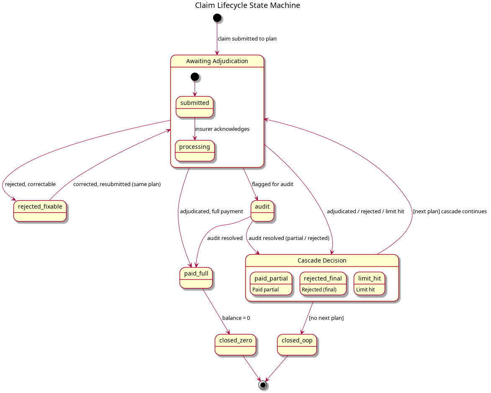

# Functional Requirements

## Core Claim Lifecycle Model

Coordinate is built around a consumer-side orchestration model that does not exist in industry-standard insurer tooling. Each insurer manages its own claim lifecycle independently; Coordinate manages the cross-plan journey from the claimant's perspective.

The organizing principle is:

> **While an unreimbursed balance remains on an expense, claim against the next applicable plan.**

An expense has an original amount. Each successful submission reduces the remaining balance. The system determines the "next applicable plan" by evaluating COB priority rules, expense category eligibility, remaining annual maximums, and the HCSA-last-payer rule. The loop continues until the balance reaches zero (fully reimbursed) or no more applicable plans exist (out-of-pocket remainder).



<details>
<summary>PlantUML source</summary>

```
@startuml diagrams/claim-lifecycle-states
title Claim Lifecycle State Machine

state "Awaiting Adjudication" as awaiting {
  [*] --> submitted
  submitted --> processing : insurer acknowledges
}

state "Cascade Decision" as cascade {
  paid_partial : Paid partial
  rejected_final : Rejected (final)
  limit_hit : Limit hit
}

[*] --> awaiting : claim submitted to plan

awaiting --> paid_full : adjudicated, full payment
awaiting --> cascade : adjudicated / rejected / limit hit
awaiting --> rejected_fixable : rejected, correctable
awaiting --> audit : flagged for audit

rejected_fixable --> awaiting : corrected, resubmitted (same plan)

audit --> paid_full : audit resolved
audit --> cascade : audit resolved (partial / rejected)

cascade --> awaiting : [next plan] cascade continues
cascade --> closed_oop : [no next plan]

paid_full --> closed_zero : balance = 0

closed_zero --> [*]
closed_oop --> [*]
@enduml
```

</details>

**Claim states:**

| State | Meaning |
|---|---|
| `submitted` | Claim sent to a plan; awaiting adjudication |
| `processing` | Plan has acknowledged receipt; decision pending |
| `paid_full` | Plan paid the full claimed amount |
| `paid_partial` | Plan paid less than claimed; remainder exists |
| `rejected_fixable` | Rejected for a correctable reason (missing doc, wrong format) |
| `rejected_final` | Rejected and not correctable for this plan |
| `audit` | Plan has flagged for manual audit; outcome pending |
| `limit_hit` | Plan's annual maximum for this category/person is exhausted; EOB may be sought before cascade continues |
| `closed_zero` | Expense fully reimbursed; balance = 0 |
| `closed_oop` | No more applicable plans; remainder is out-of-pocket |

---

## Lifecycle Feature Areas

### Expense Entry

| ID | Requirement | Priority | Acceptance Criteria |
|----|-------------|----------|---------------------|
| FR-001 | Record a new expense with: service date, Person (the family member who incurred the expense), expense category, amount, and provider name. | Must | Expense is stored and visible in the claim dashboard. All five fields are required. |
| FR-002 | Attach supporting documents (receipts, referrals, prescriptions, lab requisitions) to an expense via photo capture or file upload. Attachment is optional at entry time; documents can be added later when required by the insurer. Supported formats: JPEG, PNG, PDF. | Must | Supporting documents are stored and linked to the expense. Submission is not blocked by absence of documents. |
| FR-003 | When entering a new expense, suggest likely values (beneficiary, category, provider, amount) based on the user's expense history for that provider or category. Suggestions reduce rekeying without imposing rigid recurrence models. | Could | Suggestions appear during expense entry. Accepting a suggestion pre-fills the field; user can override. No suggestion is ever applied automatically. |
| FR-004 | Support multi-beneficiary expense attribution. A single expense can be split across multiple Persons (e.g., a joint counselling session). Surface remaining coverage per Person per category to guide attribution. Each Person's share follows its own routing and balance lifecycle. See RI-001 for open questions on insurer attribution rules. | Should | Expense can be split by Person. Remaining coverage per Person is visible at attribution time. Each split follows its own routing and balance lifecycle. |
| FR-005 | Handle provider direct-billing. When a provider has submitted directly to the primary plan, the expense enters the system with the primary submission pre-recorded (reference number, amount claimed, amount paid). The system picks up from the remainder cascade. | Should | User can mark an expense as direct-billed, enter the primary plan's payment details, and the system routes the remainder correctly. |

### Routing Engine

| ID | Requirement | Priority | Acceptance Criteria |
|----|-------------|----------|---------------------|
| FR-010 | For a given expense, determine the next applicable plan using the following ordered rules: (1) employee-first rule (own plan before spouse's plan), (2) birthday rule for dependents (primary is the parent whose birthday is earliest in the calendar year), (3) duration of coverage as a tiebreaker. | Must | Given a test family configuration and a dependent expense, the system returns the correct primary plan in accordance with CLHIA Guideline G4. Test cases must include: (a) standard birthday rule, (b) parents with the same calendar birthday (falls back to duration-of-coverage tiebreaker), (c) employee-first override. |
| FR-011 | Skip any plan that does not cover the expense category. | Must | A dental expense is not routed to a plan with no dental coverage. |
| FR-012 | When a plan's annual maximum for the relevant category and Person is exhausted, record it as `limit_hit`. Whether to submit to the exhausted plan to obtain an EOB (required by some secondary insurers) is configurable per COB relationship: yes / no / ask each time. Once resolved, the cascade continues. `limit_hit` applies to all subsequent claims of that category/Person for the remainder of the plan year. See RI-003. | Must | EOB-from-exhausted-primary behaviour respects the COB relationship configuration. Once `limit_hit`, the plan is not proposed again for that category/Person until the plan year resets. |
| FR-013 | Apply the HCSA-last-payer rule. HCSAs are never proposed before all applicable insurance plans have been evaluated. | Must | Routing engine never returns an HCSA as the next plan when an unevaluated insurance plan exists. |
| FR-014 | Handle PHSP coordination. A corporate PHSP (PER-004 scenario) does not follow standard CLHIA COB guidelines. The system must allow the user to configure PHSP priority explicitly, with a note that PHSP typically acts as last-payer relative to group insurance but before HCSA. | Should | User can set PHSP payment order in plan configuration. Routing respects the configured order. |
| FR-015 | Surface the routing decision to the user with a plain-language explanation. ("Submit to [Plan Name] because [reason]", e.g., "Submit to Sobia's Health Plan because Ben's plan has reached its annual maximum for Paramedical services.") | Must | Explanation is shown before the user confirms submission. |

### Submission Tracking

| ID | Requirement | Priority | Acceptance Criteria |
|----|-------------|----------|---------------------|
| FR-020 | Record a claim submission against a specific plan: submission date, plan, amount claimed, and reference number (optional at submission, required once received). | Must | Submission is stored linked to the expense and the specific plan. |
| FR-021 | Update a submission with the adjudication outcome: claim state (see state table above), amount paid, denial reason (if applicable), and EOB document (if available). | Must | State, amount paid, and denial reason are recorded. Remaining balance on the expense is recalculated automatically. |
| FR-022 | Store the EOB from a submission and automatically associate it as a supporting document for the next submission in the cascade. | Must | When the user initiates the next submission, the prior EOB is surfaced as an attachment. |
| FR-023 | Validate that the amount claimed against any single plan does not exceed the current remaining balance on the expense (NFR-008). | Must | System prevents or warns when claimed amount would cause total reimbursement to exceed original expense amount. |

### Follow-up and Remainder Cascade

| ID | Requirement | Priority | Acceptance Criteria |
|----|-------------|----------|---------------------|
| FR-030 | When a submission resolves with a non-zero remainder (state `paid_partial`, `rejected_final`, or `limit_hit`), automatically recalculate the remaining balance and invoke the routing engine to identify the next applicable plan. | Must | After outcome is recorded, the system immediately shows the next recommended action. |
| FR-031 | When a submission is rejected for a fixable reason (`rejected_fixable`), prompt the user to correct the issue and resubmit to the same plan. Do not advance the cascade until this plan is resolved. | Must | Fixable rejection does not advance to the next plan. User is guided to correct and resubmit. |
| FR-032 | When the routing engine finds no further applicable plans, mark the expense as `closed_oop` and record the final out-of-pocket amount. | Must | Expense shows final out-of-pocket amount. Amount is included in unreimbursed expense reporting. |
| FR-033 | When the routing engine finds no further applicable plans and the balance is zero, mark the expense as `closed_zero`. | Must | Expense is marked fully reimbursed. |
| FR-034 | Support overclaiming correction. If a user realises more was claimed from a plan than the remaining balance allowed, the system must support recording a correction (excess amount returned) and recalculating the balance. | Should | User can record a correction; balance is updated; audit trail is preserved. |

---

## Cross-Cutting Feature Areas

### Plan Configuration

| ID | Requirement | Priority | Acceptance Criteria |
|----|-------------|----------|---------------------|
| FR-040 | Define a household containing one or more Persons via Household Memberships. Each Person has a name and date of birth. A Person may belong to more than one Household (e.g., an adult dependent who is also a member of their own household). | Must | Household can be configured with all Persons. A Person added to a second Household shares their existing identity (no duplicate Person records). Birthday rule can be evaluated from stored birthdates. |
| FR-041 | Add and configure insurance plans: insurer name, plan type (group health, group dental, HCSA, PHSP), plan year start date, submission grace period (days after plan year end during which prior-year claims can still be submitted), and benefit categories with annual maximums per category per covered person. | Must | Plan configuration is stored and available to the routing engine. Grace period is stored per plan and used by deadline alerting and routing. |
| FR-042 | Define COB relationships between plans. The user can specify which plans coordinate with each other and in what order (where not fully determined by CLHIA rules). | Must | Routing engine uses configured COB order when statutory rules do not fully determine priority. |
| FR-043 | Support plan changes. When a plan holder changes employers or plans, the old plan can be marked inactive (with an end date) and a new plan added. Historical claims against the old plan are preserved. | Must | Old plan is retained in history. New plan is used for routing from its effective date. |
| FR-044 | Support multi-user household access with delegated authority. System Users select a Household context after login (GLO-033). An Insurance Manager can grant access to another System User as Contributor or co-Insurance Manager, and need not be an Insured or Beneficiary in the Household (PER-005). Roles per GLO-007 through GLO-009. Two delegation flows: (1) **Caregiver-initiated**: delegate creates a Household, becomes Insurance Manager, adds the care recipient as a Person; care recipient may later be invited as Contributor. (2) **Owner-initiated**: care recipient creates their Household, then invites the delegate as Insurance Manager. Both flows produce identical Household Membership / User Role state. | Should | Both initiation flows result in identical access. An Insurance Manager with no plan membership in the Household can fully manage it. A Contributor can submit receipts and view status but cannot edit plan configuration or COB rules. |

### Maximum and Balance Tracking

| ID | Requirement | Priority | Acceptance Criteria |
|----|-------------|----------|---------------------|
| FR-050 | Track remaining annual maximum per plan, per benefit category, per covered person. | Must | After each paid claim, the relevant maximum is decremented by the amount paid. |
| FR-051 | Reset annual maximums at the plan year boundary. During the submission grace period (configured per plan in FR-041), claims for expenses incurred in the prior plan year can still be submitted and are counted against the prior year's maximums, not the new year's. | Must | On the plan year start date, maximums reset. Claims submitted during the grace period with a service date in the prior plan year are applied against the prior year's maximums. |
| FR-052 | Track HCSA balance: total allocation, amount claimed, and remaining balance. | Must | HCSA balance is decremented as HCSA claims are paid. Remaining balance is visible to the user. |
| FR-053 | Display remaining coverage across all plans and categories for any family member, on demand. | Must | User can view a coverage summary showing remaining maximums per category per plan per person. |
| FR-054 | Alert the user when a benefit category maximum is approaching exhaustion (configurable threshold, e.g., less than 20% or less than one session's worth remaining). | Should | Alert is triggered before the maximum is hit, giving the user time to plan. |
| FR-055 | Alert the user when HCSA balance is underutilised relative to plan year progress (e.g., more than 50% of the year has passed but less than 25% of the HCSA has been used). | Should | Alert fires at a configurable point in the plan year. |
| FR-056 | Support benefit utilisation planning. Given a proposed future expense (category, amount, beneficiary), show projected remaining coverage after that expense across all plans. | Could | User can model a proposed expense and see its impact on remaining balances before booking. |

### Document Management

| ID | Requirement | Priority | Acceptance Criteria |
|----|-------------|----------|---------------------|
| FR-060 | Store Supporting Documents by reference, linked to specific expenses and submissions. References may point to local files or the user's cloud storage (e.g., Dropbox, iCloud). See NFR-051 for broken-reference handling. | Must | Every stored document is associated with an expense and, where applicable, a specific submission. |
| FR-061 | Support receipt capture via photo (mobile) and file upload (desktop). Accepted formats: JPEG, PNG, PDF. | Must | Documents can be attached from both mobile and desktop entry points. |
| FR-062 | Retain all claim-related documents per the retention floor in NFR-006. | Must | Documents cannot be deleted within the retention window unless the user explicitly overrides with acknowledgement. |

> **Architectural note**: Documents are stored by reference, not embedded (NFR-051). How captured photos are persisted to a reference-compatible location (local filesystem, cloud storage) is deferred to the solution phase, constrained by NFR-001 through NFR-007 (privacy principles).

### Alerts and Notifications

| ID | Requirement | Priority | Acceptance Criteria |
|----|-------------|----------|---------------------|
| FR-070 | Notify the user when a submission has been resolved (paid or rejected) and a follow-up action is needed. | Must | Alert is generated when an expense transitions to a state requiring user action. |
| FR-071 | Notify the user when a claim submission deadline is approaching. Two deadline types apply: (1) the insurer's absolute submission deadline from service date (typically 12-18 months), and (2) the plan year grace period end date, after which prior-year claims can no longer be submitted. | Should | Alerts fire at a configurable lead time (e.g., 60 days) before each deadline type. Both deadlines are surfaced distinctly so the user can prioritise prior-year claims during the grace window. |
| FR-072 | Notify the user when unused benefit coverage or HCSA balance is at risk of expiring before the plan year ends. | Should | Alert fires at a configurable point before plan year end, listing unused benefits by category. |
| FR-073 | Notify the user when a benefit category annual maximum is approaching exhaustion for a frequently-used category. | Should | Alert fires when remaining maximum falls below a configurable threshold. |

### Reporting

| ID | Requirement | Priority | Acceptance Criteria |
|----|-------------|----------|---------------------|
| FR-080 | Generate a year-end unreimbursed expense summary per family member: total expenses, total reimbursed, and total out-of-pocket, for any calendar year or 12-month period. | Must | Report can be exported (CSV or PDF). Values reconcile with individual expense records. |
| FR-081 | Provide an expense history view filterable by family member, expense category, plan, and date range. | Must | User can filter and view any subset of historical expenses and their claim outcomes. |
| FR-082 | Provide an HCSA utilisation summary for the current and prior plan years: allocation, claimed, paid, and remaining. | Should | Summary is available per HCSA. |
| FR-083 | Provide a benefit utilisation summary for the current plan year: remaining maximums by category and plan. | Should | Summary covers all configured plans and categories. |

### Insurer Integration

Insurer interaction is delivered as three progressive capability tiers. Higher tiers depend on insurer API availability and portal stability, which varies by insurer and must be evaluated during solution design.

| ID | Requirement | Priority | Acceptance Criteria |
|----|-------------|----------|---------------------|
| FR-090 | For each submission, provide step-by-step guidance specific to the insurer and plan type: which portal or submission channel to use, which documents to attach, and which fields to complete. | Must | Guidance is shown before the user begins each submission. Content is specific to the insurer (not generic). |
| FR-091 | Retrieve claim status from insurer portals or APIs and update the corresponding submission state automatically. | Should | Submission state is updated without manual user input when the insurer adjudicates the claim. |
| FR-092 | Submit claims to insurer portals or APIs on the user's behalf. | Could | A claim can be submitted end-to-end by the system without the user navigating the insurer portal. |

> **Architectural note**: FR-091 and FR-092 may require browser automation where APIs are unavailable. Feasibility is insurer-specific and may be revisited as integration surface is explored during solution design. Insurers that cannot be automated fall back to FR-090 (guided manual submission).

