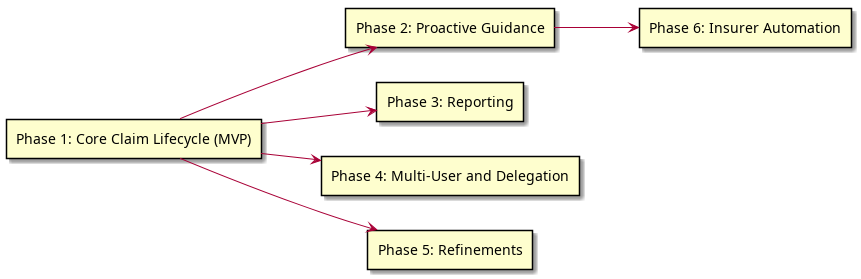

# Scope, Boundaries, and Phasing

## In Scope

Coordinate delivers a consumer-side insurance claim orchestration tool for Canadian families. It covers:

- **Claim lifecycle management**: Expense entry, COB-aware routing, submission tracking, remainder cascade, and closure across multiple insurance plans, HCSAs, and PHSPs.
- **Plan and household configuration**: Household membership, plan setup (including plan year and grace period), COB relationship configuration, and plan changes over time.
- **Balance and maximum tracking**: Per-plan, per-category, per-person annual maximum tracking; HCSA balance tracking; plan year reset with grace period handling.
- **Document management**: Supporting documents (receipts, referrals, EOBs) stored by reference and linked to expenses and submissions.
- **Proactive guidance**: Alerts for pending actions, approaching deadlines, expiring benefits, and underutilised HCSA balances; insurer-specific submission guidance.
- **Reporting**: Year-end unreimbursed expense summaries, expense history, and benefit utilisation views.
- **Multi-user access**: Household-scoped roles (Insurance Manager, Contributor), delegated authority including the caregiver pattern, multi-household context switching.
- **Insurer integration** (progressive): Guided manual submission (baseline), automated status retrieval (where feasible), automated claim submission (where feasible).

## Out of Scope

### CRA / Tax Reporting Boundary

Coordinate tracks unreimbursed out-of-pocket expenses as part of its core claim lifecycle. A year-end summary of these expenses -- exportable per family member -- is a natural byproduct and is in scope. However, CRA medical expense tax credit (METC) eligibility determination, tax optimization (e.g., which spouse should claim, optimal 12-month claiming period), and tax advice are out of scope. Coordinate is an insurance claims tool, not a tax tool.

### Future Considerations

The following are adjacent to the core problem but out of scope for now. They could be revisited in future phases once the claim submission workflow is solid.

- **Provider direct-billing awareness**: Knowing which providers can bill which insurer directly would let Coordinate skip unnecessary manual submission steps or flag when manual claims are needed. This depends on whether provider-insurer billing relationships are discoverable programmatically.
- **Plan comprehension**: Since Coordinate will model plan details for claim routing, surfacing coverage explanations ("what does my plan cover for orthodontics?") is a small incremental step. However, the core product is a claims workflow tool, not a benefits education or plan comparison tool.

---

## Feature Phases

Requirements are grouped into phases that each deliver usable, testable value. Phases are ordered by dependency, not calendar schedule. Target timelines are deferred until the solution phase.



<details>
<summary>PlantUML source</summary>

```
@startuml diagrams/phase-dependencies
left to right direction

rectangle "Phase 1: Core Claim Lifecycle (MVP)" as P1
rectangle "Phase 2: Proactive Guidance" as P2
rectangle "Phase 3: Reporting" as P3
rectangle "Phase 4: Multi-User and Delegation" as P4
rectangle "Phase 5: Refinements" as P5
rectangle "Phase 6: Insurer Automation" as P6

P1 --> P2
P1 --> P3
P1 --> P4
P1 --> P5
P2 --> P6
@enduml
```

</details>

### Phase 1 — Core Claim Lifecycle (MVP)

The minimum to enter an expense, route it through the COB cascade, track submissions, and close it. Validates G1 for a single user managing a single household.

| Feature Area | FRs | Priority |
|---|---|---|
| Plan configuration | FR-040, FR-041, FR-042 | Must |
| Expense entry | FR-001, FR-002 | Must |
| Routing engine | FR-010, FR-011, FR-012, FR-013, FR-015 | Must |
| Submission tracking | FR-020, FR-021, FR-022, FR-023 | Must |
| Remainder cascade | FR-030, FR-031, FR-032, FR-033 | Must |
| Balance tracking | FR-050, FR-051, FR-052, FR-053 | Must |
| Document management | FR-060, FR-061, FR-062 | Must |

**Depends on**: Nothing (foundation).

### Phase 2 — Proactive Guidance

The system tells the user what to do next and when. Transforms Coordinate from a record-keeping tool into an active assistant.

| Feature Area | FRs | Priority |
|---|---|---|
| Action and deadline alerts | FR-070, FR-071 | Must / Should |
| Benefit expiry and HCSA alerts | FR-072, FR-073, FR-054, FR-055 | Should |
| Insurer-specific submission guidance | FR-090 | Must |

**Depends on**: Phase 1 (claim state transitions, plan config, and max tracking drive the alerts).

### Phase 3 — Reporting

Year-end summaries, expense history, and utilisation views. Independent of Phase 2.

| Feature Area | FRs | Priority |
|---|---|---|
| Year-end summary | FR-080 | Must |
| Expense history | FR-081 | Must |
| HCSA utilisation | FR-082 | Should |
| Benefit utilisation | FR-083 | Should |

**Depends on**: Phase 1 (closed expenses and balance data).

### Phase 4 — Multi-User and Delegation

Sobia as Contributor, Nadia as caregiver, multi-household context switching. Orthogonal to Phases 2 and 3 -- it's about *who* can do things, not *what* things exist. Can be developed in parallel with Phases 2–3.

| Feature Area | FRs | Priority |
|---|---|---|
| Multi-user household access | FR-044 | Should |

**Depends on**: Phase 1 (household and plan configuration must exist before access control is meaningful).

**Note**: When a Person belongs to multiple Households (e.g., Mira in Ben's household and her own), cross-household COB is handled via External Coverage (GLO-035, FR-045) and document sharing (EOBs, receipts), not plan data sharing. No plan data crosses the Household boundary. See NFR-045.

### Phase 5 — Refinements

Enhancements that improve the core experience but aren't required for it to function. Items are mutually independent and can be prioritised individually.

| Feature Area | FRs | Priority |
|---|---|---|
| Smart suggestions | FR-003 | Could |
| Multi-beneficiary attribution | FR-004 | Should |
| Direct billing | FR-005 | Should |
| Pre-recorded external submission | FR-046 | Should |
| External Coverage (multi-household COB) | FR-045 | Should |
| PHSP coordination | FR-014 | Should |
| Plan changes | FR-043 | Must (but needed only when it happens) |
| Overclaim correction | FR-034 | Should |
| Utilisation planning | FR-056 | Could |

**Depends on**: Phase 1.

### Phase 6 — Insurer Automation

Progressive automation of insurer portal interaction. Each tier builds on the previous. Feasibility is insurer-specific and must be evaluated per-insurer.

| Feature Area | FRs | Priority |
|---|---|---|
| Status retrieval | FR-091 | Should |
| Automated submission | FR-092 | Could |

**Depends on**: Phase 1 (submission tracking) and Phase 2 (FR-090 submission guidance establishes the insurer-specific knowledge base that automation builds on).

---

## MVP Definition

The MVP is **Phase 1**. It is the smallest deliverable that validates the core value proposition: a single user (Ben) can manage a household's insurance claims across multiple plans, track the COB cascade, and close expenses -- replacing the current spreadsheet process.

**MVP validated when (ties to G1):**

- Ben's family claims are fully tracked through Coordinate
- Routing engine correctly determines the next plan for all family members (employee-first, birthday rule, HCSA-last-payer)
- HCSA utilisation is tracked and visible
- No claim is missed or left incomplete due to the system failing to prompt the next step
- Supporting documents are stored by reference and linked to expenses

The MVP does not include alerts, reporting, multi-user access, or insurer automation. These are delivered in subsequent phases.

---

## FR Dependencies

Moved from the functional requirements document. Shows which FRs depend on others regardless of phasing.

| FR | Depends On | Notes |
|----|------------|-------|
| FR-010 (routing) | FR-040 (plan config), FR-050 (max tracking) | Routing cannot determine next plan without knowing plan configuration and remaining maximums. |
| FR-011 (category skip) | FR-041 (plan categories) | Category eligibility is derived from plan configuration. |
| FR-012 (limit hit) | FR-050 (max tracking) | Exhaustion state is read from maximum tracking. |
| FR-030 (remainder cascade) | FR-010 (routing), FR-021 (outcome recording) | Cascade is triggered by outcome recording; next plan comes from routing engine. |
| FR-022 (EOB linking) | FR-020, FR-021 | EOB is produced from submission tracking and linked to next submission. |
| FR-070 (action alerts) | FR-021, FR-030 | Alerts fire based on claim state transitions. |
| FR-071 (deadline alerts) | FR-041 (grace period), FR-051 (plan year) | Grace period end date is a key deadline type. |
| FR-072 (expiry alerts) | FR-051 (plan year reset), FR-052 (HCSA balance) | Alerts compare current date to plan year end and remaining balances. |
| FR-073 (limit alerts) | FR-050 (max tracking) | Alerts compare remaining maximum to configured threshold. |
| FR-080 (year-end report) | FR-032, FR-033 | Out-of-pocket amounts come from closed expenses. |
| FR-056 (utilisation planning) | FR-050 (max tracking) | Projection requires current remaining maximum state. |
| FR-090 (submission guidance) | FR-041 (plan config) | Guidance is specific to the insurer configured on the plan. |
| FR-091 (status retrieval) | FR-020, FR-090 | Status retrieval enhances the submission tracking flow. |

---

## Open Research Items

Questions flagged during requirements gathering that must be resolved during solution design.

| ID | Question | Source | Impact |
|----|----------|--------|--------|
| RI-001 | Do insurers require multi-beneficiary expenses to be split proportionally, or can the full amount be attributed flexibly to one beneficiary? | FR-004 | Determines whether strategic beneficiary attribution is a valid optimisation or violates insurer rules. |
| RI-002 | Which major Canadian insurers (Sun Life, Manulife, Blue Cross, Desjardins, Great-West Life) offer APIs or stable portal structures suitable for automated status retrieval or claim submission? | FR-091, FR-092 | Determines feasibility and scope of Phase 6. |
| RI-003 | When a primary plan's annual maximum is exhausted, do secondary insurers consistently require an EOB from the exhausted primary, or will they accept a claim without one? | FR-012 | Determines the default for the "EOB from exhausted primary" COB relationship configuration. |
| RI-004 | What is the typical submission grace period length across major Canadian group benefit plans? | FR-041, FR-051 | Informs the default grace period value in plan configuration. |
