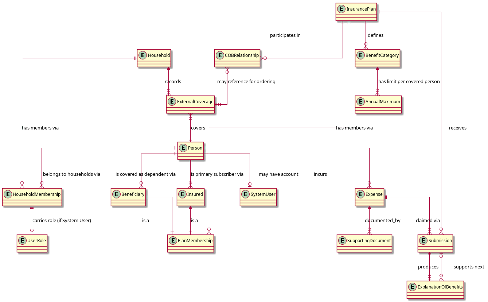

# Domain Glossary

Consistent terminology used across all requirements documents. This is the authoritative source for domain language in Coordinate. All other documents reference terms by their GLO-NNN ID rather than redefining them.

## Conceptual Domain Model

This diagram shows the key concepts of the problem domain and their relationships. It is a problem-domain model, not a data or implementation model -- it describes *what exists* in the domain, not how the system will store or process it.



<details>
<summary>PlantUML source</summary>

```
@startuml diagrams/domain-model
skinparam linetype ortho

entity Person
entity Household
entity HouseholdMembership
entity UserRole
entity Insured
entity Beneficiary
entity PlanMembership
entity InsurancePlan
entity BenefitCategory
entity AnnualMaximum
entity COBRelationship
entity ExternalCoverage
entity Expense
entity Submission
entity ExplanationOfBenefits
entity SupportingDocument
entity SystemUser

Person ||--o{ HouseholdMembership : "belongs to households via"
Household ||--o{ HouseholdMembership : "has members via"
HouseholdMembership ||--o| UserRole : "carries role (if System User)"
Person ||--o{ Insured : "is primary subscriber via"
Person ||--o{ Beneficiary : "is covered as dependent via"
Insured ||--|| PlanMembership : "is a"
Beneficiary ||--|| PlanMembership : "is a"
InsurancePlan ||--o{ PlanMembership : "has members via"
InsurancePlan ||--o{ BenefitCategory : defines
BenefitCategory ||--o{ AnnualMaximum : "has limit per covered person"
InsurancePlan ||--o{ COBRelationship : "participates in"
Household ||--o{ ExternalCoverage : "records"
ExternalCoverage }o--|| Person : "covers"
COBRelationship }o--o{ ExternalCoverage : "may reference for ordering"
Person ||--o{ Expense : incurs
Expense ||--o{ Submission : "claimed via"
Submission ||--o| ExplanationOfBenefits : produces
ExplanationOfBenefits }o--o| Submission : "supports next"
Expense ||--o{ SupportingDocument : documented_by
InsurancePlan ||--o{ Submission : receives
Person ||--o| SystemUser : "may have account"
@enduml
```

</details>

## Glossary

### Household and People

| ID | Term | Also Known As | Definition |
|----|------|---------------|------------|
| GLO-001 | Household | | The top-level container for a family unit using Coordinate. A Household has one or more Persons (via Household Membership), one or more Insurance Plans, and one or more System Users. |
| GLO-002 | Person | | A unique individual known to Coordinate. Has a name and date of birth (required for Birthday Rule evaluation). A Person has a single identity and, if applicable, a single set of credentials. A Person may belong to one or more Households via Household Membership. Not all Persons are System Users (e.g., minor dependents). |
| GLO-033 | Household Membership | | The association between a Person and a Household. A Person may hold memberships in more than one Household (e.g., an adult dependent who also has their own household). A System User selects which Household context to operate in after login. Plan Memberships, Expenses, and Submissions are scoped to a Household context. See GLO-007 for role scoping. |
| GLO-003 | Plan Membership | | An association between a Person and an Insurance Plan, evaluated within a Household context. Has two subtypes: Insured and Beneficiary. |
| GLO-004 | Insured | Plan Holder, Subscriber, Member | A Person who is the primary subscriber of an Insurance Plan -- typically the employee whose employer sponsors the plan. Has a direct relationship with the insurer (account holder, portal access). An Insured's own plan is always primary for their own claims (Employee-First Rule). |
| GLO-005 | Beneficiary | Dependent, Covered Person | A Person covered under another person's Insurance Plan (e.g., a spouse or child listed as a dependent). Has no direct relationship with the insurer; their claims flow through the Insured's plan. A Person can simultaneously be an Insured on their own plan and a Beneficiary on a spouse's plan. |
| GLO-006 | System User | User | A Person who has an account in Coordinate (see GLO-002 for the distinction). A System User may belong to one or more Households and holds a User Role per Household Membership. |
| GLO-007 | User Role | | The access level a System User holds within a specific Household Membership. Two roles exist: Insurance Manager and Contributor. A System User may hold different User Roles in different Households. |
| GLO-008 | Insurance Manager | Primary User, Family Insurance Manager | A User Role (per Household Membership) with full access: configure the Household, plans, and Coordination of Benefits relationships; submit and track claims for any Person in the Household. |
| GLO-009 | Contributor | Secondary User | A User Role (per Household Membership) with limited access: submit receipts and view claim status. Cannot modify plan configuration or Coordination of Benefits rules. |

### Insurance Plans and Coverage

| ID | Term | Also Known As | Definition |
|----|------|---------------|------------|
| GLO-010 | Insurance Plan | Plan | A specific insurance arrangement covering one or more Persons. Types include: Group Health Plan, Group Dental Plan, Health Care Spending Account, and Private Health Services Plan. Characterized by an insurer, plan type, Plan Year, covered members, and Benefit Categories with limits. |
| GLO-011 | Group Health Plan | Employer Health Plan | An employer-sponsored plan covering extended health benefits (paramedical, prescriptions, medical equipment, hospital). Subject to Coordination of Benefits rules. |
| GLO-012 | Group Dental Plan | Employer Dental Plan | An employer-sponsored plan covering dental expenses (preventive, major restorative, orthodontic). Subject to Coordination of Benefits rules. Some insurers offer health and dental as a combined plan; others as separate plans. |
| GLO-013 | Health Care Spending Account | HCSA, HSA | An employer-funded spending account that reimburses CRA-eligible medical and dental expenses not covered (or not fully covered) by insurance. Always the last payer -- must be claimed after all applicable Insurance Plans have been evaluated. Not subject to standard COB guidelines. |
| GLO-014 | Private Health Services Plan | PHSP | A CRA-approved health benefits plan established by an incorporated self-employed person through their corporation. Covers CRA-eligible medical expenses. Does not follow standard CLHIA COB guidelines; payment order relative to group plans must be configured explicitly. Typically last-payer relative to group insurance, but before an HCSA. |
| GLO-015 | Benefit Category | Coverage Category | A type of eligible expense within an Insurance Plan (e.g., dental preventive, dental major, vision, massage therapy, physiotherapy, prescription drugs). Each category may have its own Annual Maximum, coinsurance rate, and eligibility rules. |
| GLO-016 | Annual Maximum | Category Limit | The cap on reimbursement for a specific Benefit Category, for a specific covered person, within a single Plan Year. Annual Maximums are a three-way constraint: category × covered person × plan year. Once exhausted, the plan enters Plan Exhaustion for that category/person for the remainder of the Plan Year. |
| GLO-017 | Plan Year | Benefit Year | The 12-month period over which Annual Maximums accrue and reset. Plan Years often differ from the calendar year; each Insurance Plan has its own Plan Year start date. |
| GLO-018 | Plan Exhaustion | Limit Hit | The state in which an Insurance Plan's Annual Maximum for a specific Benefit Category and covered person has been fully consumed. A plan in Plan Exhaustion for a given category/person is skipped by the Routing Engine for all subsequent claims of that type until the Plan Year resets. Plan Exhaustion is a plan-year-wide state, not per-expense. |
| GLO-019 | Coordination of Benefits | COB | The rules that determine the order in which multiple Insurance Plans pay claims for the same expense, ensuring combined reimbursement does not exceed the eligible expense amount. Governed in Canada by CLHIA Guideline G4 for group plans. |
| GLO-020 | COB Relationship | Coordination Relationship | The ordering relationship between two or more Insurance Plans within a Household. Encodes which plan is primary and which is secondary for a given claimant, based on the Employee-First Rule, Birthday Rule, or explicit configuration (for plan types not subject to standard COB rules). May also reference External Coverage (GLO-035) for ordering purposes when a Person has coverage outside this Household. |
| GLO-021 | Employee-First Rule | | A Coordination of Benefits priority rule: a plan covering a person as an Insured (employee/subscriber) is always primary over a plan covering them as a Beneficiary (dependent). |
| GLO-022 | Birthday Rule | | A Coordination of Benefits priority rule for dependent children covered under both parents' plans: the plan of the parent whose birthday falls earliest in the calendar year (month and day only, ignoring birth year) is primary. If both parents share a birthday, the plan active longest is primary. |
| GLO-023 | Canada Revenue Agency | CRA | The federal agency responsible for administering Canadian tax law, including the rules governing eligible medical expenses for Health Care Spending Accounts, Private Health Services Plans, and the Medical Expense Tax Credit. |
| GLO-035 | External Coverage | | A lightweight record within a Household indicating that a Person has insurance coverage under a plan managed outside this Household. Stores enough information for COB ordering (insurer name, plan type, COB position hint) but not coverage details (limits, utilization, benefit categories). The Routing Engine treats External Coverage as an opaque step in the cascade — it recommends "submit to [external plan] first" without evaluating eligibility or limits. Cross-household information flows occur through user-initiated document sharing (EOBs, receipts), not plan data sharing. |

### Claims and Expenses

| ID | Term | Also Known As | Definition |
|----|------|---------------|------------|
| GLO-024 | Expense | Health Expense | A health or dental expenditure incurred by a Person. Has an original amount and a Remaining Balance that is reduced as Submissions resolve. An Expense is the top-level unit of work in Coordinate; all Submissions, Receipts, and Explanations of Benefits are linked to an Expense. |
| GLO-025 | Remaining Balance | Unreimbursed Balance | The portion of an Expense's original amount not yet reimbursed by any plan. Drives the Routing Engine loop: while Remaining Balance > 0 and applicable plans exist, claim against the next applicable plan. |
| GLO-026 | Submission | Claim Submission | A claim submitted to a specific Insurance Plan for a specific Expense. Records submission date, plan, amount claimed, reference number, and adjudication outcome. An Expense may have multiple Submissions (one per plan in the Claim Cascade). |
| GLO-027 | Claim State | Submission Status | The current status of a Submission. Valid states: `submitted`, `processing`, `paid_full`, `paid_partial`, `rejected_fixable`, `rejected_final`, `audit`, `limit_hit`, `closed_zero`, `closed_oop`. See the claim state table in Functional Requirements for definitions. |
| GLO-028 | Explanation of Benefits | EOB | The document produced by an insurer after adjudicating a Submission. Shows: amount claimed, amount paid, amount denied, and reasons for any denial. Required as a supporting document when submitting a subsequent claim to a secondary plan or Health Care Spending Account. |
| GLO-034 | Supporting Document | | Any document attached to an Expense or Submission to satisfy insurer requirements. Subtypes include: Receipt (GLO-029), referral (physician authorization required for some paramedical claims), prescription, and lab requisition. Attachment is optional at expense entry time -- insurers may request specific documents after submission (triggering a `rejected_fixable` state). |
| GLO-029 | Receipt | | A Supporting Document (GLO-034) from the provider (dentist, pharmacist, therapist, etc.). Must include: patient name, provider name, service date, and itemized services and amounts. See NFR-006 for retention requirements. |
| GLO-030 | Routing Engine | | The system logic that determines the next applicable Insurance Plan for a given Expense, given the current Remaining Balance. Evaluates: Coordination of Benefits priority rules, Benefit Category eligibility per plan, Annual Maximum remaining per category/person/plan, and the Health Care Spending Account last-payer rule. Invoked at each iteration of the Claim Cascade. |
| GLO-031 | Claim Cascade | Remainder Cascade | The sequential process of submitting an Expense to multiple Insurance Plans, one after another, until the Remaining Balance reaches zero or no applicable plans remain. Each step is driven by the Routing Engine. Formalizes the consumer-side heuristic: "while an unreimbursed balance remains, claim against the next applicable plan." |
| GLO-032 | Medical Expense Tax Credit | METC | A CRA non-refundable tax credit for eligible medical expenses not reimbursed by insurance or an HCSA. The out-of-pocket Remaining Balance on closed Expenses is the input. Coordinate surfaces unreimbursed amounts as a reporting byproduct; it does not provide tax advice. |
