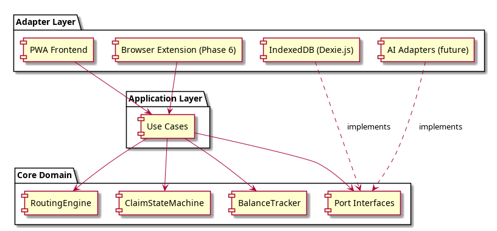

# Solution Overview and Approach

## Solution Summary

Coordinate is a **local-first Progressive Web App** built in **TypeScript** that manages the consumer-side insurance claim lifecycle for Canadian families. All user data stays on-device; the application is served as static files with no backend server for MVP.

The system is structured as an **onion / ports-and-adapters architecture** where the core domain — COB routing engine, claim state machine, and balance tracker — has zero external dependencies and is testable in isolation. Adapter implementations for storage, UI, and future integrations (browser extension, AI) plug into domain-defined port interfaces.

The claim lifecycle is modeled as a **pure domain state machine** with well-defined states, events, and transition guards, driven by user actions and deterministic COB rules rather than an external workflow engine.

## Key Design Decisions

| Decision | Rationale | ADR |
|----------|-----------|-----|
| Onion / ports-and-adapters architecture | Core domain must be testable in isolation and reusable across deployment models. Single-maintainer sustainability. | [ADR-001](adr/001-ports-and-adapters.md) |
| Claim lifecycle as domain state machine | Human-paced workflow with well-defined states. No distributed coordination needed. Keeps domain dependency-free. | [ADR-002](adr/002-claim-lifecycle-state-machine.md) |
| Local-first PWA deployment | Privacy by architecture (data on-device). Near-zero operational cost. Approachable via URL. | [ADR-003](adr/003-local-first-pwa.md) |
| TypeScript as primary language | One language across domain, frontend, and browser extension. Strong type system for domain modeling. | [ADR-004](adr/004-typescript-primary-language.md) |
| Browser extension for insurer automation | Piggybacks on user's authenticated session. No credential routing through Coordinate. | [ADR-005](adr/005-browser-extension-insurer-automation.md) |
| AI as optional adapter | Core logic must be deterministic. AI behind ports for future document parsing and portal navigation. Not in MVP. | [ADR-006](adr/006-ai-optional-adapter.md) |

## Alternatives Considered

| Alternative | Why Rejected |
|-------------|--------------|
| Hosted web app with backend | Centralizes sensitive health/financial data; higher cost and infrastructure burden; premature for G1 validation |
| Desktop app (Electron/Tauri) | Requires installation, reducing approachability for G2; Tauri remains an option as a future PWA wrapper |
| External workflow engine (Temporal, XState in core) | Overkill for human-paced, single-user state machine; adds dependencies or infrastructure incompatible with constraints |
| AI-first architecture | Non-deterministic core logic; cloud AI cost and privacy conflicts; safety-critical paths (overclaim prevention) require determinism |

## Architectural Style

Onion / ports-and-adapters (hexagonal architecture) — see [ADR-001](adr/001-ports-and-adapters.md) for full rationale.



<details>
<summary>PlantUML source</summary>

```
@startuml diagrams/architecture-overview
skinparam packageStyle rectangle

package "Adapter Layer" as adapters {
  [PWA Frontend]
  [IndexedDB / SQLite-WASM]
  [Browser Extension (Phase 6)]
  [AI Adapters (future)]
}

package "Application Layer" as application {
  [Use Cases]
}

package "Core Domain" as domain {
  [RoutingEngine]
  [ClaimStateMachine]
  [BalanceTracker]
  [Port Interfaces]
}

[PWA Frontend] --> [Use Cases]
[Browser Extension (Phase 6)] --> [Use Cases]
[Use Cases] --> [RoutingEngine]
[Use Cases] --> [ClaimStateMachine]
[Use Cases] --> [BalanceTracker]
[Use Cases] --> [Port Interfaces]
[IndexedDB / SQLite-WASM] ..> [Port Interfaces] : implements
[AI Adapters (future)] ..> [Port Interfaces] : implements
@enduml
```

</details>
