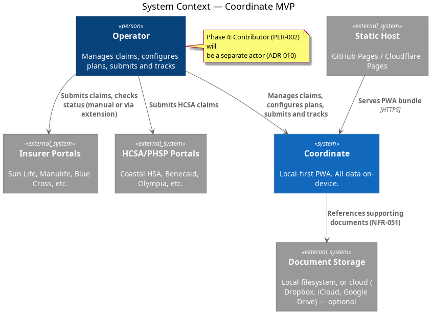
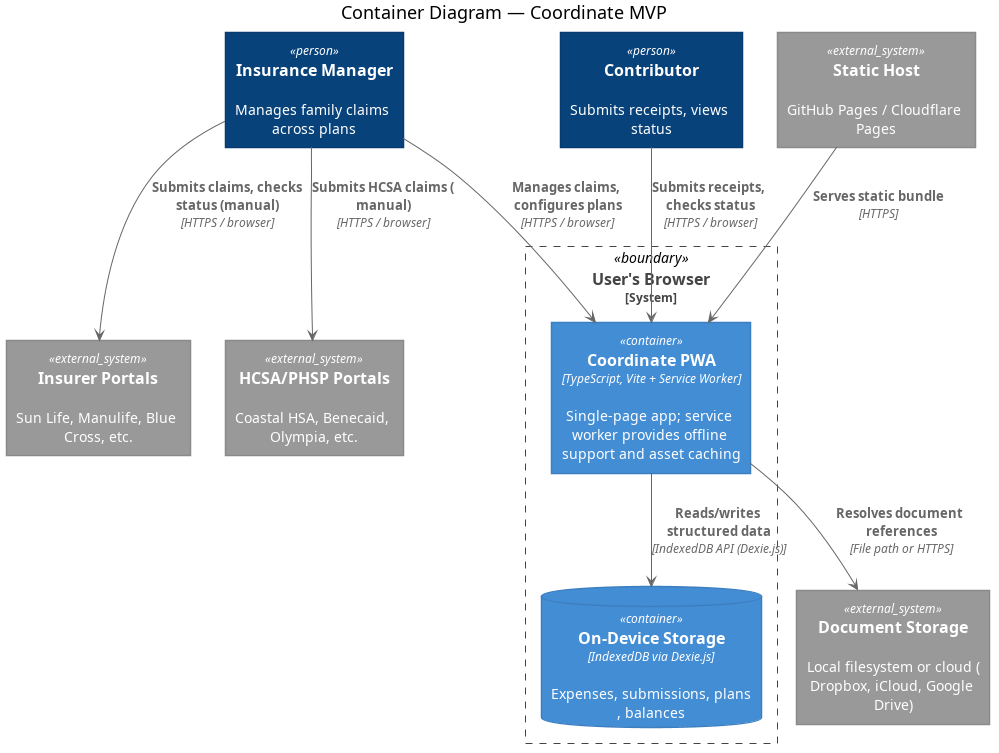
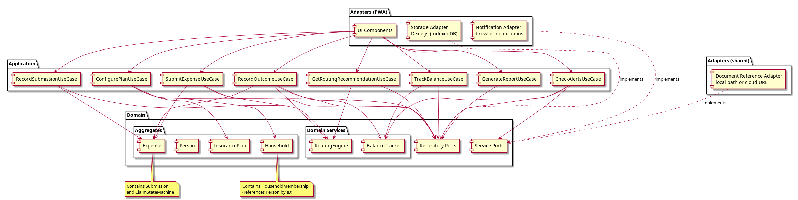
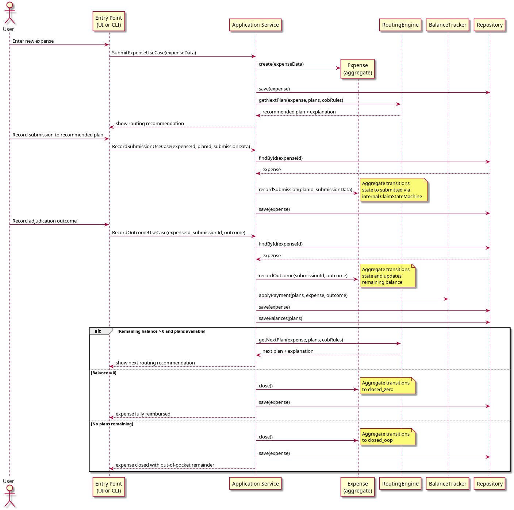

# System Architecture

## System Context Diagram

Coordinate runs on the user's own device in the browser (PWA). It interacts with insurer portals only through the user's own authenticated sessions (via an optional browser extension in Phase 6). No backend server exists for MVP.



<details>
<summary>PlantUML source</summary>

```
@startuml diagrams/system-context
!include <C4/C4_Context>

title System Context — Coordinate

Person(user, "Insurance Manager", "Manages family claims across plans")
Person(contributor, "Contributor", "Submits receipts, views status")

System(coordinate, "Coordinate", "Local-first PWA. All data on-device.")

System_Ext(staticHost, "Static Host", "GitHub Pages / Cloudflare Pages")
System_Ext(insurerPortal, "Insurer Portals", "Sun Life, Manulife, Blue Cross, etc.")
System_Ext(hcsaPortal, "HCSA/PHSP Portals", "Coastal HSA, Benecaid, Olympia, etc.")
System_Ext(docStorage, "Document Storage", "Local filesystem, or cloud (Dropbox, iCloud, Google Drive) — optional")

Rel(staticHost, coordinate, "Serves PWA bundle", "HTTPS")
Rel(user, coordinate, "Manages claims, configures plans")
Rel(contributor, coordinate, "Submits receipts, checks status")
Rel(user, insurerPortal, "Submits claims, checks status (manual or via extension)")
Rel(user, hcsaPortal, "Submits HCSA claims")
Rel(coordinate, docStorage, "References supporting documents (NFR-051)")
@enduml
```

</details>

### MVP boundaries

- Coordinate is single-user, single-device (PWA). No sync, no shared state.
- Insurer interaction is manual (guided by Coordinate). The browser extension is Phase 6.
- Contributor access (PER-002) is Phase 4.
- Document storage references are optional (NFR-051); they may point to local filesystem paths or cloud storage.
- Cross-household COB (when a Person has coverage in multiple Households) is handled via External Coverage (GLO-035) and document sharing — not plan data sharing. See [Data Model](03-data-model.md#household-as-data-isolation-boundary).

## Container Diagram

For MVP, the PWA (served as static files) is the sole entry point. The core domain and application layers are consumed by PWA adapters.



<details>
<summary>PlantUML source</summary>

```
@startuml diagrams/containers
!include <C4/C4_Container>

title Container Diagram — Coordinate MVP

Person(user, "Insurance Manager", "Manages family claims across plans")
Person(contributor, "Contributor", "Submits receipts, views status")

System_Boundary(browser, "User's Browser") {
    Container(pwa, "Coordinate PWA", "TypeScript, Vite + Service Worker", "Single-page app; service worker provides offline support and asset caching")
    ContainerDb(storage, "On-Device Storage", "IndexedDB / SQLite-WASM via OPFS", "Expenses, submissions, plans, balances")
}

System_Ext(staticHost, "Static Host", "GitHub Pages / Cloudflare Pages")
System_Ext(insurerPortal, "Insurer Portals", "Sun Life, Manulife, Blue Cross, etc.")
System_Ext(hcsaPortal, "HCSA/PHSP Portals", "Coastal HSA, Benecaid, Olympia, etc.")
System_Ext(docStorage, "Document Storage", "Local filesystem or cloud (Dropbox, iCloud, Google Drive)")

Rel(staticHost, pwa, "Serves static bundle", "HTTPS")
Rel(user, pwa, "Manages claims, configures plans", "HTTPS / browser")
Rel(contributor, pwa, "Submits receipts, checks status", "HTTPS / browser")
Rel(pwa, storage, "Reads/writes structured data", "IndexedDB / OPFS API")
Rel(pwa, docStorage, "Resolves document references", "File path or HTTPS")
Rel(user, insurerPortal, "Submits claims, checks status (manual)", "HTTPS / browser")
Rel(user, hcsaPortal, "Submits HCSA claims (manual)", "HTTPS / browser")
@enduml
```

</details>

### Future containers (not in MVP)

- **Browser extension** (Phase 6): companion Chrome extension for insurer portal automation. Communicates with the PWA via messaging API.
- **Sync service** (Phase 4): lightweight relay or CRDT-based sync for multi-user/multi-device. Scope and technology TBD.

## Component Diagram

Internal structure of the application, following the onion architecture (ADR-001). The PWA drives use cases via UI components and the storage adapter.



<details>
<summary>PlantUML source</summary>

```
@startuml diagrams/components
skinparam componentStyle rectangle

package "Adapters (PWA)" as adaptersPwa {
    [UI Components]
    [Storage Adapter\nIndexedDB / SQLite-WASM]
    [Notification Adapter\nbrowser notifications]
}

package "Adapters (shared)" as adaptersShared {
    [Document Reference Adapter\nlocal path or cloud URL]
}

package "Application" as application {
    [SubmitExpenseUseCase]
    [RecordSubmissionUseCase]
    [RecordOutcomeUseCase]
    [GetRoutingRecommendationUseCase]
    [ConfigurePlanUseCase]
    [TrackBalanceUseCase]
    [GenerateReportUseCase]
    [CheckAlertsUseCase]
}

package "Domain" as domain {
    package "Aggregates" as aggregates {
        [Expense] as expense
        [InsurancePlan] as plan
        [Person] as person
        [Household] as household
    }
    package "Domain Services" as domainServices {
        [RoutingEngine]
        [BalanceTracker]
    }
    [Repository Ports]
    [Service Ports]
}

note bottom of expense : Contains Submission\nand ClaimStateMachine
note bottom of household : Contains HouseholdMembership\n(references Person by ID)

[UI Components] --> [SubmitExpenseUseCase]
[UI Components] --> [RecordSubmissionUseCase]
[UI Components] --> [RecordOutcomeUseCase]
[UI Components] --> [GetRoutingRecommendationUseCase]
[UI Components] --> [ConfigurePlanUseCase]
[UI Components] --> [TrackBalanceUseCase]
[UI Components] --> [GenerateReportUseCase]
[UI Components] --> [CheckAlertsUseCase]

[SubmitExpenseUseCase] --> expense
[SubmitExpenseUseCase] --> [RoutingEngine]
[SubmitExpenseUseCase] --> [Repository Ports]
[RecordSubmissionUseCase] --> expense
[RecordSubmissionUseCase] --> [Repository Ports]
[RecordOutcomeUseCase] --> expense
[RecordOutcomeUseCase] --> [RoutingEngine]
[RecordOutcomeUseCase] --> [BalanceTracker]
[RecordOutcomeUseCase] --> [Repository Ports]
[GetRoutingRecommendationUseCase] --> [RoutingEngine]
[GetRoutingRecommendationUseCase] --> [Repository Ports]
[ConfigurePlanUseCase] --> plan
[ConfigurePlanUseCase] --> household
[ConfigurePlanUseCase] --> [Repository Ports]
[TrackBalanceUseCase] --> [BalanceTracker]
[TrackBalanceUseCase] --> [Repository Ports]
[GenerateReportUseCase] --> [Repository Ports]
[CheckAlertsUseCase] --> [BalanceTracker]
[CheckAlertsUseCase] --> [Repository Ports]
[CheckAlertsUseCase] --> [Service Ports]

[Storage Adapter\nIndexedDB / SQLite-WASM] ..> [Repository Ports] : implements
[Document Reference Adapter\nlocal path or cloud URL] ..> [Service Ports] : implements
[Notification Adapter\nbrowser notifications] ..> [Service Ports] : implements
@enduml
```

</details>

## Data Flow

### Core claim lifecycle flow



<details>
<summary>PlantUML source</summary>

```
@startuml diagrams/claim-lifecycle-sequence
actor User
participant "Entry Point\n(PWA UI)" as UI
participant "Application Service" as AS
participant "Expense\n(aggregate)" as Exp
participant "RoutingEngine" as RE
participant "BalanceTracker" as BT
participant "Repository" as Repo

User -> UI: Enter new expense
UI -> AS: SubmitExpenseUseCase(expenseData)
AS -> Exp **: create(expenseData)
AS -> Repo: save(expense)
AS -> RE: getNextPlan(expense, plans, cobRules)
RE --> AS: recommended plan + explanation
AS --> UI: show routing recommendation

User -> UI: Record submission to recommended plan
UI -> AS: RecordSubmissionUseCase(expenseId, planId, submissionData)
AS -> Repo: findById(expenseId)
Repo --> AS: expense
AS -> Exp: recordSubmission(planId, submissionData)
note right: Aggregate transitions\nstate to submitted via\ninternal ClaimStateMachine
AS -> Repo: save(expense)

User -> UI: Record adjudication outcome
UI -> AS: RecordOutcomeUseCase(expenseId, submissionId, outcome)
AS -> Repo: findById(expenseId)
Repo --> AS: expense
AS -> Exp: recordOutcome(submissionId, outcome)
note right: Aggregate transitions\nstate and updates\nremaining balance
AS -> BT: applyPayment(plans, expense, outcome)
AS -> Repo: save(expense)
AS -> Repo: saveBalances(plans)

alt Remaining balance > 0 and plans available
    AS -> RE: getNextPlan(expense, plans, cobRules)
    RE --> AS: next plan + explanation
    AS --> UI: show next routing recommendation
else Balance = 0
    AS -> Exp: close()
    note right: Aggregate transitions\nto closed_zero
    AS -> Repo: save(expense)
    AS --> UI: expense fully reimbursed
else No plans remaining
    AS -> Exp: close()
    note right: Aggregate transitions\nto closed_oop
    AS -> Repo: save(expense)
    AS --> UI: expense closed with out-of-pocket remainder
end
@enduml
```

</details>
