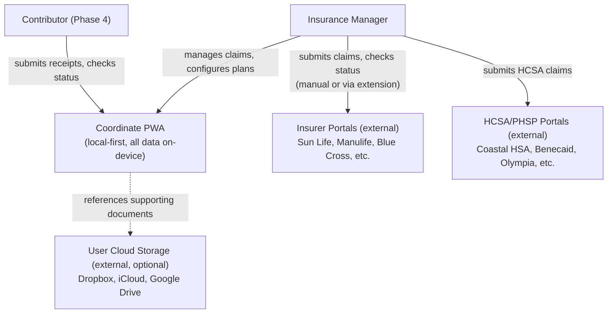
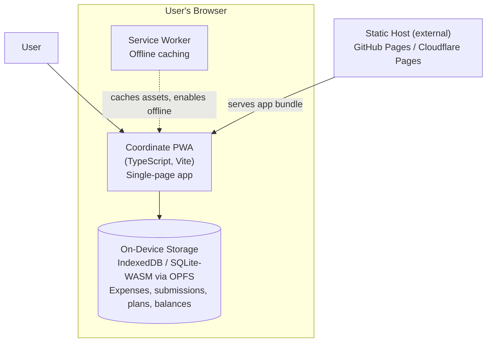
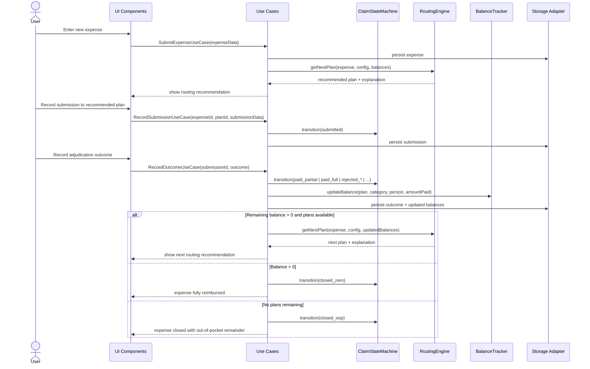

# System Architecture

## System Context Diagram

Coordinate exists in the user's browser. It interacts with insurer portals only through the user's own authenticated sessions (via an optional browser extension in Phase 6). No backend server exists for MVP.

### MVP boundaries

- Coordinate is a single-user, single-device PWA. No sync, no shared state.
- Insurer interaction is manual (guided by Coordinate). The browser extension is Phase 6.
- Contributor access (PER-002) is Phase 4.
- Cloud storage references are optional (NFR-051).

## Container Diagram

For MVP, there is a single deployable container: the PWA, served as static files.

### Future containers (not in MVP)

- **Browser extension** (Phase 6): companion Chrome extension for insurer portal automation. Communicates with the PWA via messaging API.
- **Sync service** (Phase 4): lightweight relay or CRDT-based sync for multi-user/multi-device. Scope and technology TBD.

## Component Diagram

Internal structure of the PWA, following the onion architecture (ADR-001).

```mermaid
flowchart TB
    subgraph adaptersLayer ["Adapters"]
        UIComponents["UI Components"]
        StorageAdapter["Storage Adapter (IndexedDB / SQLite-WASM)"]
        DocRefAdapter["Document Reference Adapter"]
        NotificationAdapter["Notification Adapter (browser notifications)"]
    end

    subgraph applicationLayer ["Application"]
        SubmitExpense["SubmitExpenseUseCase"]
        RecordOutcome["RecordOutcomeUseCase"]
        GetRouting["GetRoutingRecommendationUseCase"]
        ConfigurePlan["ConfigurePlanUseCase"]
        TrackBalance["TrackBalanceUseCase"]
    end

    subgraph domainLayer ["Domain"]
        Expense["Expense"]
        Submission["Submission"]
        Plan["InsurancePlan"]
        Person["Person"]
        Household["Household"]
        RoutingEngine["RoutingEngine"]
        ClaimStateMachine["ClaimStateMachine"]
        BalanceTracker["BalanceTracker"]
        RepoPorts["Repository Ports"]
        ServicePorts["Service Ports"]
    end

    UIComponents --> SubmitExpense
    UIComponents --> RecordOutcome
    UIComponents --> GetRouting
    UIComponents --> ConfigurePlan
    UIComponents --> TrackBalance

    SubmitExpense --> Expense
    SubmitExpense --> ClaimStateMachine
    SubmitExpense --> RepoPorts
    RecordOutcome --> ClaimStateMachine
    RecordOutcome --> RoutingEngine
    RecordOutcome --> BalanceTracker
    RecordOutcome --> RepoPorts
    GetRouting --> RoutingEngine
    ConfigurePlan --> Plan
    ConfigurePlan --> RepoPorts
    TrackBalance --> BalanceTracker
    TrackBalance --> RepoPorts

    StorageAdapter -.->|implements| RepoPorts
    DocRefAdapter -.->|implements| ServicePorts
    NotificationAdapter -.->|implements| ServicePorts
```

## Data Flow

### Core claim lifecycle flow

