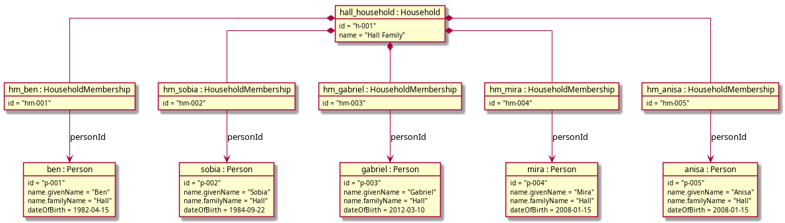
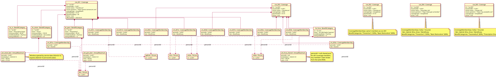
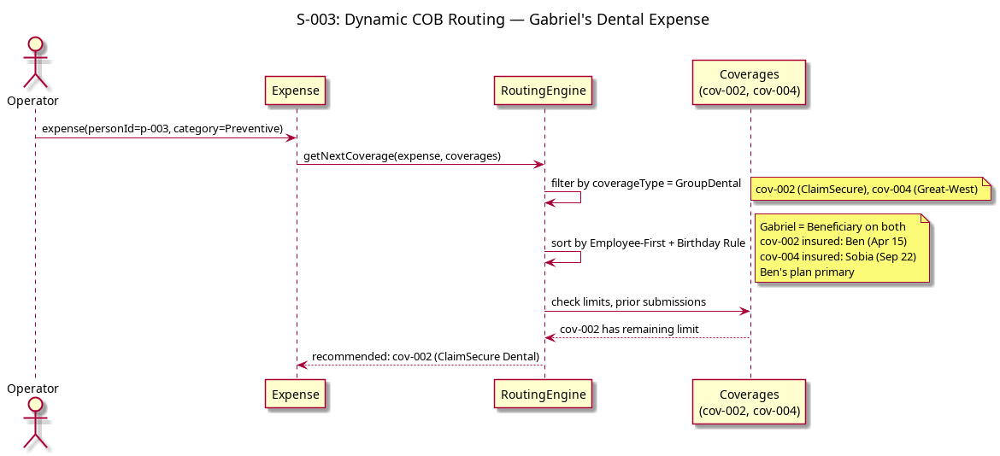

# Data Model and Storage

This document defines the solution-level domain model — aggregate boundaries, entities, value objects, invariants, and storage mapping. It bridges from the [conceptual domain model](../01-requirements/10-glossary.md#conceptual-domain-model) (analysis-level, what exists in the domain) to the implementation model (where the consistency boundaries are and why).

## Domain Model

Five aggregates form the core of the domain. Each aggregate is a transactional consistency boundary: all mutations within an aggregate are atomic, and cross-aggregate references are by identity only.


<details>
<summary>PlantUML source</summary>

```
@startuml diagrams/aggregate-map
skinparam linetype ortho
skinparam packageStyle rectangle
skinparam class {
    BackgroundColor<<root>> #FEFECE
    BackgroundColor<<entity>> #E8F4FD
    BackgroundColor<<value>> #F0F0F0
}
hide empty methods

package "Person Aggregate" as PA {
    class Person <<root>> {
        id: PersonId
        name: PersonName
        dateOfBirth: CalendarDate
    }
}

package "Household Aggregate" as HA {
    class Household <<root>> {
        id: HouseholdId
    }
    class HouseholdMembership <<entity>> {
        personId: PersonId
    }
    Household *-- "1..*" HouseholdMembership
}

package "ExternalCoverage Aggregate" as ECA {
    class ExternalCoverage <<root>> {
        id: ExternalCoverageId
        householdId: HouseholdId
        personId: PersonId
        insurerName: string
        planType: PlanType
        cobPositionHint: string
    }
}

package "Coverage Aggregate" as CA {
    class Coverage <<root>> {
        id: CoverageId
        householdId: HouseholdId
        insurer: Insurer
        coverageType: PlanType
        cobPriority: number?
        planYearStart: MonthDay
        gracePeriodDays: number
        active: boolean
    }
    class CoverageMembership <<entity>> {
        personId: PersonId
        role: MembershipRole
    }
    class BenefitCategory <<entity>> {
        id: CategoryId
        name: string
        limitWindowMode: LimitWindowMode
        limitCycleMonths: number
    }
    class AnnualMaximum <<value>> {
        personId: PersonId?
        windowStart: CalendarDate
        limit: Money
        used: Money
    }
    Coverage *-- "1..*" CoverageMembership
    Coverage *-- "0..*" BenefitCategory
    BenefitCategory *-- "0..*" AnnualMaximum
}

package "Expense Aggregate" as EA {
    class Expense <<root>> {
        id: ExpenseId
        householdId: HouseholdId
        personId: PersonId
        category: string
        serviceDate: CalendarDate
        providerName: string
        originalAmount: Money
        remainingBalance: Money
    }
    class Submission <<entity>> {
        id: SubmissionId
        coverageId: CoverageId?
        externalCoverageId: ExternalCoverageId?
        state: ClaimState
        submissionDate: CalendarDate
        amountClaimed: Money
        amountPaid: Money?
        referenceNumber: string?
        denialReason: string?
    }
    class DocumentRef <<value>> {
        uri: string
        type: DocumentType
    }
    Expense *-- "0..*" Submission
    Expense *-- "0..*" DocumentRef : supportingDocs
    Submission *-- "0..1" DocumentRef : eobRef
}

' Cross-aggregate references
HouseholdMembership ..> Person : personId
CoverageMembership ..> Person : personId
AnnualMaximum ..> Person : personId
Expense ..> Person : personId
ExternalCoverage ..> Person : personId
ExternalCoverage ..> Household : householdId
Coverage ..> Household : householdId
Expense ..> Household : householdId
Submission ..> Coverage : coverageId
Submission ..> ExternalCoverage : externalCoverageId?

@enduml
```

</details>

### Aggregate summary

| Aggregate | Root | Internal Entities | Key Value Objects | Key Invariants |
|-----------|------|-------------------|-------------------|----------------|
| Person | Person | — | CalendarDate | Single identity across households (GLO-002, FR-040) |
| Household | Household | HouseholdMembership | — | HouseholdMembership references Person |
| ExternalCoverage | ExternalCoverage | — | — | personId references an existing Person; householdId references an existing Household |
| Coverage | Coverage | CoverageMembership, BenefitCategory | AnnualMaximum, Insurer, PlanType, PlanYear | AnnualMaximum.used ≤ AnnualMaximum.limit; all CoverageMembership persons exist |
| Expense | Expense | Submission | DocumentRef, ClaimState, Money | No-overclaim: sum of amountPaid across submissions ≤ originalAmount (NFR-008); valid state transitions only (ADR-002) |

### Domain services (not aggregates)

| Service | Purpose | Operates on |
|---------|---------|-------------|
| RoutingEngine | Determines the next applicable coverage for an expense (GLO-030) | Receives Expense + Coverage[] + ExternalCoverage[] as parameters; pure computation, no I/O. Operates within a single Household. COB ordering is computed dynamically from CoverageMembership.role, Person.dateOfBirth, coverageType, Coverage.cobPriority (for PHSP), and ExternalCoverage.cobPositionHint (GLO-035, FR-010). |
| BalanceTracker | Updates coverage balance state after a payment (FR-050) | Receives Coverage[] + payment details; mutates AnnualMaximum values on the coverages |

These are domain services because they coordinate logic across aggregate boundaries. The Application Service loads the required aggregates, passes them in, and saves the results (see [claim lifecycle sequence](02-architecture.md#core-claim-lifecycle-flow)).

## Aggregate Boundaries

### Person

**Boundary decision**: Person is a separate aggregate root, not contained within Household.

**Rationale**: A Person has a single identity across the system (GLO-002). A Person may belong to multiple Households via HouseholdMembership (GLO-033, FR-040). If Person were internal to Household, each Household would hold its own copy, violating the "no duplicate Person records" requirement (FR-040). Person is also referenced by Expense (the person who incurred it), by CoverageMembership (the person covered by a coverage), and by AnnualMaximum (the person whose limit is tracked). All of these are cross-aggregate references by PersonId.

**Lifecycle**: Created when the Operator adds a family member. Persists independently of any Household — removing a Person from a Household does not delete them if they belong to another Household. Phase 4 will introduce identity references for multi-user access (see ADR-010).

### Household

**Boundary decision**: Household is an aggregate root containing HouseholdMembership as its only internal entity.

**Rationale**: HouseholdMembership is scoped to a single Household and has no meaning outside it — it represents "this Person belongs to this Household." It is a configuration entity that changes infrequently and is always accessed in the context of its Household.

The Household aggregate represents the family unit's configuration: who is in it. COB ordering between internal Coverages is computed dynamically by the RoutingEngine from CoverageMembership and Person data — no stored relationship entities are needed.

**HouseholdMembership references Person by ID**, not by containment. When a Person is added to a second Household, a new HouseholdMembership is created in the second Household referencing the existing PersonId. The Person aggregate is not modified.

### ExternalCoverage

**Boundary decision**: ExternalCoverage is a separate aggregate root, not contained within Household.

**Rationale**: ExternalCoverage has its own identity (`ExternalCoverageId`), is referenced by Submission (in the Expense aggregate) via `externalCoverageId`, and has a lifecycle independent of other Household mutations. Keeping it inside the Household aggregate would force Submission to violate the "cross-aggregate references target roots only" rule. Promoting it follows the same logic as Person — lightweight but independently loadable. ExternalCoverage records lightweight references to coverage a Person has outside this Household — enough for COB ordering via `cobPositionHint`, without coverage details (limits, utilization). It references Household by `householdId` (for scoping) and Person by `personId` (the person who has this external coverage).

### Coverage

**Boundary decision**: Coverage is an aggregate root containing CoverageMembership, BenefitCategory, and AnnualMaximum. Each Coverage represents a single coverage type (e.g., GroupHealth, GroupDental, HCSA) — the independent unit of claim submission with its own limits, COB ordering, and membership. An employer's benefits package that includes health, dental, and HCSA is modelled as three separate Coverage aggregates because each is an independent claim submission target.

**Rationale**: A coverage's configuration (who it covers, what categories it has, what the limits are) is a cohesive unit. All of these entities are meaningless outside the context of their coverage. CoverageMembership records which Persons are covered and in what capacity (Insured vs Beneficiary) — this is needed by the RoutingEngine to apply the Employee-First Rule (GLO-021) and Birthday Rule (GLO-022). BenefitCategory defines what expense types the coverage includes. AnnualMaximum tracks both the configured limit and the current usage per person per plan year.

**AnnualMaximum includes tracked usage** (`used` field) alongside the configured `limit`. This is a pragmatic decision: the RoutingEngine needs both the limit and current usage to determine whether a coverage is exhausted (GLO-018). Keeping them together avoids a cross-aggregate read. The BalanceTracker domain service mutates AnnualMaximum values on Coverage aggregates — the Application Service passes the coverages in and saves them afterward.

**AnnualMaximum.personId is optional.** When set, the limit applies per-person (the usual case for group health/dental — each covered person has their own cap). When null, the limit is a shared pool across all coverage members (the HCSA case — one household allocation, consumed by claims from any member). The RoutingEngine sums `used` across all claims for the category regardless of claimant when evaluating a shared-pool limit.

**BenefitCategory.limitWindowMode and limitCycleMonths control when limits reset.** Two modes exist: `PlanYear` (default) — window boundaries are calendar-aligned to the coverage's `planYearStart`; the RoutingEngine computes `windowStart` for a given service date and finds the matching AnnualMaximum. `ServiceDate` — the window is anchored to the service date of the first qualifying claim and expires `limitCycleMonths` later; no prior claim = immediately eligible. Vision typically uses `ServiceDate` + `limitCycleMonths = 24`: eligibility starts two years after the previous claim's service date. AnnualMaximum.windowStart records the start of the window (plan-year boundary for PlanYear mode; actual service date for ServiceDate mode). When a new window begins, a fresh AnnualMaximum is created with `used = 0`.

**Insurer is a value object** (`name` + `portalUrl`) on Coverage. The operator interacts with an insurer's portal to batch-submit claims across all coverage types from that insurer. **Requirements evolution (FR-047):** an **insurer directory** (reusable carrier records) will be the place to create insurer identity once; each Coverage then references or snapshots that identity so the user does not re-key name and URL for every Coverage line. Until implemented, duplicating the Insurer value on each Coverage remains acceptable at small data scale; the UI groups coverages by `insurer.name` for portal navigation. **Open modeling (RI-005):** whether to add a **Benefits Program** aggregate to group Coverages and declare a single subscriber Person once per employer package — versus keeping one Insured CoverageMembership per Coverage today.

**HCSA and PHSP coverages** use the same model: an HCSA is a Coverage with `coverageType = HCSA` and a single BenefitCategory representing the total allocation. This unifies the storage and routing model across coverage types, with the RoutingEngine applying HCSA-specific rules (last-payer, FR-013) based on coverageType.

**Cross-aggregate references**: Coverage references Household by `householdId` (coverages are scoped to a household). CoverageMembership references Person by `personId`.

### Expense

**Boundary decision**: Expense is an aggregate root containing Submission and DocumentRef. The ClaimStateMachine is internal behavior of this aggregate.

**Rationale**: The Expense is the top-level unit of work in Coordinate (GLO-024). All Submissions belong to a single Expense and are always accessed through it. The no-overclaim invariant (NFR-008) — that total reimbursement across all submissions never exceeds the original amount — spans the Expense and its Submissions, making this a natural consistency boundary. The remaining balance is a derived value maintained by the aggregate as submissions resolve.

**The ClaimStateMachine** (ADR-002) is not a standalone domain component. It is internal behavior of the Expense aggregate, enforcing valid state transitions on Submissions. When the Application Service calls `expense.recordOutcome(submissionId, outcome)`, the aggregate internally validates the transition via the state machine, updates the Submission's state, recalculates the remaining balance, and rejects invalid transitions.

**Submission** is an entity (not a value object) because it has identity — a SubmissionId — and a lifecycle (state transitions from `submitted` through adjudication to a terminal state). But it has no independent lifecycle: a Submission is always created, accessed, and mutated through its parent Expense.

**DocumentRef** is a value object. Documents are stored by reference (NFR-051) — a URI pointing to a local file or cloud storage. The actual document bytes are external to the domain. DocumentRef appears on both Expense (supporting documents like receipts) and Submission (EOB reference). ExplanationOfBenefits metadata (amount claimed, amount paid, denial reasons per GLO-028) is captured directly on the Submission entity; the EOB document itself is just a DocumentRef.

### Household as Data Scoping Boundary

Household is the **data scoping boundary** for all domain data. Coverage data — benefit limits, utilization tracking, claim status, and data retrieved via browser extension (FR-091, FR-092) — is scoped to the Household that owns the relevant Coverage. ExternalCoverage is its own aggregate but scoped to a Household via `householdId` — loaded and displayed in the same household context. Data from one Household is not shown when operating in another Household context (UI navigation). Phase 4 will introduce access control; until then, the Operator has full access to all data on the device (ADR-010).

Cross-household COB (e.g., a Person with coverage in multiple Households per PER-001 Mira scenario) is handled via **ExternalCoverage + document sharing**, not coverage data sharing. When Ben enters an expense for Mira in his Household after she has processed it through her spouse's coverage in her own Household, he records the outcome via FR-046 (pre-recorded external submission) and attaches the EOB. The RoutingEngine picks up from the remainder through Ben's Household's coverages. No coverage data from Mira's Household crosses the boundary.

## Data Dictionary

### Shared value types

| Type | Definition | Examples |
|------|------------|---------|
| PersonName | Value object: `givenName`, `familyName` (required), `additionalNames` (optional). Display: `${givenName} ${familyName}`. Maps to First/Last Name fields on insurer forms. | `{ givenName: "Mira", familyName: "Jones" }` |
| Money | Non-negative decimal amount in CAD. Precision: 2 decimal places. | `125.00`, `0.00` |
| CalendarDate | Date without time zone, ISO 8601 format. | `2026-03-15` |
| MonthDay | Month and day only (for plan year start, birthday rule). | `01-01`, `09-15` |
| PlanYear | A specific 12-month benefit period, identified by start date. | `2026-01-01` (for a plan year starting Jan 1, 2026) |
| PlanType | Enum: `GroupHealth`, `GroupDental`, `HCSA`, `PHSP`. Used as `coverageType` on Coverage and ExternalCoverage. | |
| Insurer | Value object: `name` (required string), `portalUrl` (optional URL). Duplicated across coverages from the same insurer — acceptable at MVP data scale. | `{ name: "ClaimSecure", portalUrl: "https://portal.claimsecure.com" }` |
| MembershipRole | Enum: `Insured`, `Beneficiary` | |
| LimitWindowMode | Enum: `PlanYear` \| `ServiceDate`. `PlanYear`: window boundaries aligned to coverage's `planYearStart`. `ServiceDate`: window starts on the service date of the first qualifying claim, expires `limitCycleMonths` later. No prior claim = immediately eligible. | Used for vision (ServiceDate, 24 months), orthodontic |
| ClaimState | Enum: `submitted`, `processing`, `paid_full`, `paid_partial`, `rejected_fixable`, `rejected_final`, `audit`, `limit_hit`, `closed_zero`, `closed_oop` | Per GLO-027 |
| DocumentType | Enum: `Receipt`, `EOB`, `Referral`, `Prescription`, `LabRequisition` | Per GLO-034 |
| Percentage | Decimal 0–100, 2 decimal places. Used for coinsurance rates. | `80.00` |

### Person Aggregate

| Field | Type | Constraints | Notes |
|-------|------|-------------|-------|
| id | PersonId (UUID) | PK, immutable | |
| name | PersonName | Required | givenName + familyName; maps to insurer form fields |
| dateOfBirth | CalendarDate | Required | Used for Birthday Rule (GLO-022) |

### Household Aggregate

**Household**

| Field | Type | Constraints | Notes |
|-------|------|-------------|-------|
| id | HouseholdId (UUID) | PK, immutable | |
| name | string | Required | Display name for household context switching (GLO-033) |

**HouseholdMembership**

| Field | Type | Constraints | Notes |
|-------|------|-------------|-------|
| id | MembershipId (UUID) | PK, immutable | |
| householdId | HouseholdId | FK → Household, immutable | |
| personId | PersonId | FK → Person (cross-aggregate) | |

### ExternalCoverage Aggregate

**ExternalCoverage**

| Field | Type | Constraints | Notes |
|-------|------|-------------|-------|
| id | ExternalCoverageId (UUID) | PK, immutable | |
| householdId | HouseholdId | FK → Household (cross-aggregate), immutable | |
| personId | PersonId | FK → Person (cross-aggregate) | The person who has this external coverage |
| insurerName | string | Required | Display name for routing explanation (e.g., "Mira's spouse's plan") |
| planType | PlanType | Required | GroupHealth, GroupDental, HCSA, or PHSP |
| cobPositionHint | string | Required | Enough for RoutingEngine to place in COB order (e.g., "primary per birthday rule"). RoutingEngine slots ExternalCoverage into the dynamically computed order using this hint. |

ExternalCoverage has no benefit categories, limits, or utilization — only COB ordering information (GLO-035, FR-045).

### Coverage Aggregate

**Coverage**

| Field | Type | Constraints | Notes |
|-------|------|-------------|-------|
| id | CoverageId (UUID) | PK, immutable | |
| householdId | HouseholdId | FK → Household (cross-aggregate), immutable | |
| insurer | Insurer | Required | Value object: `{ name, portalUrl? }`. e.g., `{ name: "Sun Life", portalUrl: "https://www.sunlife.ca/member" }` |
| coverageType | PlanType | Required | Determines routing behavior (HCSA-last-payer, PHSP rules) |
| planYearStart | MonthDay | Required | e.g., `01-01` for calendar-year plans (GLO-017) |
| gracePeriodDays | number | Required, ≥ 0 | Days after plan year end to submit prior-year claims (FR-041) |
| active | boolean | Required, default true | Set to false when coverage ends (FR-043) |
| effectiveDate | CalendarDate | Required | When coverage began; tiebreaker for Birthday Rule (GLO-022) |
| endDate | CalendarDate? | Optional | Set when coverage is deactivated (FR-043) |
| cobPriority | number? | Optional | `null` = use CLHIA rules (default). Set for PHSP or other non-standard ordering. RoutingEngine sorts by: Employee-First → Birthday Rule → cobPriority fallback. |

**CoverageMembership**

| Field | Type | Constraints | Notes |
|-------|------|-------------|-------|
| id | CoverageMembershipId (UUID) | PK, immutable | |
| coverageId | CoverageId | FK → Coverage, immutable | |
| personId | PersonId | FK → Person (cross-aggregate) | |
| role | MembershipRole | Required | `Insured` = primary subscriber (GLO-004); `Beneficiary` = dependent (GLO-005) |

Invariant: exactly one CoverageMembership with role = Insured per Coverage.

**BenefitCategory**

| Field | Type | Constraints | Notes |
|-------|------|-------------|-------|
| id | CategoryId (UUID) | PK, immutable | |
| coverageId | CoverageId | FK → Coverage, immutable | |
| name | string | Required | e.g., "Paramedical", "Dental Preventive", "Vision" (GLO-015) |
| coinsuranceRate | Percentage? | Optional | e.g., 80% = coverage pays 80% of eligible amount |
| limitWindowMode | LimitWindowMode | Required, default PlanYear | PlanYear = calendar-aligned cycle; ServiceDate = rolling window anchored to last service date |
| limitCycleMonths | number | Required, > 0, default 12 | Duration of the limit window in months. For PlanYear mode, how often cycles reset; for ServiceDate mode, window length from first claim. Vision typically uses ServiceDate + 24. |

For HCSA coverages, a single BenefitCategory (e.g., "All CRA-Eligible Expenses") with `limitWindowMode = PlanYear`, `limitCycleMonths = 12`, and one shared-pool AnnualMaximum (`personId = null`).

**AnnualMaximum** (value object)

| Field | Type | Constraints | Notes |
|-------|------|-------------|-------|
| personId | PersonId? | FK → Person (cross-aggregate), optional | The covered person this limit applies to. When null, the limit is a shared pool across all coverage members (GLO-016). |
| windowStart | CalendarDate | Required | Start of the limit window this record tracks. For PlanYear mode: plan-year boundary (e.g., `2026-01-01`). For ServiceDate mode: the actual service date that opened this window (e.g., `2024-03-15`). |
| limit | Money | Required, > 0 | Configured cap for this category × person-or-pool × limit window |
| used | Money | Required, ≥ 0, ≤ limit | Amount consumed by paid claims. Updated by BalanceTracker. |

Identity: `(categoryId, personId?, windowStart)` — compound natural key. When `personId` is null the key is `(categoryId, null, windowStart)` — one record per window for the shared pool. Replaced (not mutated) on update per value object semantics.

### Expense Aggregate

**Expense**

| Field | Type | Constraints | Notes |
|-------|------|-------------|-------|
| id | ExpenseId (UUID) | PK, immutable | |
| householdId | HouseholdId | FK → Household (cross-aggregate), immutable | Scoped to household context (GLO-033) |
| personId | PersonId | FK → Person (cross-aggregate), immutable | The person who incurred the expense (GLO-024) |
| category | string | Required | Maps to BenefitCategory names for routing. User-entered. |
| serviceDate | CalendarDate | Required | Date the service was received |
| providerName | string | Required | e.g., "Dr. Smith", "Shoppers Drug Mart" |
| originalAmount | Money | Required, > 0, immutable | Total expense amount |
| remainingBalance | Money | Required, ≥ 0 | Derived: originalAmount − sum(submission.amountPaid). Maintained by aggregate. (GLO-025) |
| supportingDocs | DocumentRef[] | 0..* | Receipts, referrals, prescriptions (GLO-034, FR-002) |

Invariant: `remainingBalance = originalAmount − sum(submissions.filter(s => s.amountPaid != null).map(s => s.amountPaid))`. Enforced by the aggregate on every mutation.

Invariant: `sum(amountPaid) ≤ originalAmount` (NFR-008, FR-023).

**Submission**

| Field | Type | Constraints | Notes |
|-------|------|-------------|-------|
| id | SubmissionId (UUID) | PK, immutable | |
| expenseId | ExpenseId | FK → Expense, immutable | |
| coverageId | CoverageId? | FK → Coverage (cross-aggregate), optional | The coverage this claim was submitted to. Null for pre-recorded external submissions (FR-005, FR-046). |
| externalCoverageId | ExternalCoverageId? | FK → ExternalCoverage (cross-aggregate), optional | Set for pre-recorded external submissions (FR-046). Exactly one of coverageId or externalCoverageId must be set. |
| state | ClaimState | Required | Governed by internal ClaimStateMachine (ADR-002) |
| submissionDate | CalendarDate | Required | When the claim was submitted to the plan |
| amountClaimed | Money | Required, > 0, ≤ expense.remainingBalance at time of submission | FR-023 |
| amountPaid | Money? | Set on adjudication | Amount the plan paid. Null until adjudicated. |
| referenceNumber | string? | Optional at submission, encouraged once received | Insurer claim reference (FR-020) |
| denialReason | string? | Set if rejected | Free text; insurer's stated reason |
| eobRef | DocumentRef? | Set after adjudication | Reference to the Explanation of Benefits document (GLO-028, FR-022) |

**DocumentRef** (value object)

| Field | Type | Constraints | Notes |
|-------|------|-------------|-------|
| uri | string | Required, non-empty | Local file path or cloud storage URL (NFR-051) |
| type | DocumentType | Required | Receipt, EOB, Referral, Prescription, LabRequisition |

## Illustrative Object Snapshots

Concrete object instances for specific scenarios, showing real field values rather than types. Each snapshot is a valid state of the domain model and can be used to verify that the class model is expressive enough to represent real situations.

### S-001 · Ben's Household — Persons and Household configuration

Five-person household, two employed adults with separate coverages, three dependents. Coverage objects (CoverageMemberships, BenefitCategories) are deferred to S-002.



<details>
<summary>PlantUML source</summary>

```
@startuml diagrams/s001-household
skinparam linetype ortho
hide empty methods

object "ben : Person" as ben {
  id = "p-001"
  name.givenName = "Ben"
  name.familyName = "Hall"
  dateOfBirth = 1982-04-15
}

object "sobia : Person" as sobia {
  id = "p-002"
  name.givenName = "Sobia"
  name.familyName = "Hall"
  dateOfBirth = 1984-09-22
}

object "gabriel : Person" as gabriel {
  id = "p-003"
  name.givenName = "Gabriel"
  name.familyName = "Hall"
  dateOfBirth = 2012-03-10
}

object "mira : Person" as mira {
  id = "p-004"
  name.givenName = "Mira"
  name.familyName = "Hall"
  dateOfBirth = 2008-01-15
}

object "anisa : Person" as anisa {
  id = "p-005"
  name.givenName = "Anisa"
  name.familyName = "Hall"
  dateOfBirth = 2008-01-15
}

object "hall_household : Household" as household {
  id = "h-001"
  name = "Hall Family"
}

object "hm_ben : HouseholdMembership" as hm_ben {
  id = "hm-001"
}

object "hm_sobia : HouseholdMembership" as hm_sobia {
  id = "hm-002"
}

object "hm_gabriel : HouseholdMembership" as hm_gabriel {
  id = "hm-003"
}

object "hm_mira : HouseholdMembership" as hm_mira {
  id = "hm-004"
}

object "hm_anisa : HouseholdMembership" as hm_anisa {
  id = "hm-005"
}

household *-- hm_ben
household *-- hm_sobia
household *-- hm_gabriel
household *-- hm_mira
household *-- hm_anisa

hm_ben --> ben : personId
hm_sobia --> sobia : personId
hm_gabriel --> gabriel : personId
hm_mira --> mira : personId
hm_anisa --> anisa : personId

@enduml
```

</details>

### S-002 · Hall Family — Coverage Aggregates

Ben's employer provides one group benefits package through ClaimSecure, which in the data model is three separate Coverage aggregates — one per coverage type — because each is an independent claim submission target with its own limits, COB ordering, and membership. Sobia's employer provides dental through Great West Life and health + HCSA through Canada Life — three more Coverage aggregates. Six coverage roots in total for the household.

Two model features are illustrated in full detail here:

- **Vision (cov-001, bc_vision)**: `limitWindowMode = ServiceDate` and `limitCycleMonths = 24` — eligibility is a rolling window anchored to the last claim's service date. Ben's `am_vision_ben` has `windowStart = 2024-03-15` (the date he bought glasses); the window expires 2026-03-15, two years later.
- **HCSA shared pool (cov-003, am_hcsa_shared)**: `personId = null` on AnnualMaximum models a single shared $500 allocation across all five coverage members. Any member's claim draws from the same pool; the RoutingEngine sums usage across all claimants when checking exhaustion.

Each Coverage carries an `insurer` value object (name + portalUrl) so the operator can navigate to the insurer's portal for batch claim submission.



<details>
<summary>PlantUML source</summary>

```
@startuml diagrams/s002-coverages
skinparam linetype ortho
hide empty methods

' --- Person stubs (cross-aggregate references) ---

object "ben : Person" as ben {
  id = "p-001"
}

object "sobia : Person" as sobia {
  id = "p-002"
}

object "gabriel : Person" as gabriel {
  id = "p-003"
}

object "mira : Person" as mira {
  id = "p-004"
}

object "anisa : Person" as anisa {
  id = "p-005"
}

' --- Ben's ClaimSecure Health (full detail) ---

object "cov_001 : Coverage" as cov001 {
  id = "cov-001"
  householdId = "h-001"
  insurer.name = "ClaimSecure"
  insurer.portalUrl = "https://portal.claimsecure.com"
  coverageType = GroupHealth
  planYearStart = 01-01
  gracePeriodDays = 90
  active = true
  effectiveDate = 2020-03-01
}

object "cm_001a : CoverageMembership" as cm001a {
  personId = "p-001"
  role = Insured
}

object "cm_001b : CoverageMembership" as cm001b {
  personId = "p-002"
  role = Beneficiary
}

object "cm_001c : CoverageMembership" as cm001c {
  personId = "p-003"
  role = Beneficiary
}

object "cm_001d : CoverageMembership" as cm001d {
  personId = "p-004"
  role = Beneficiary
}

object "cm_001e : CoverageMembership" as cm001e {
  personId = "p-005"
  role = Beneficiary
}

object "bc_para : BenefitCategory" as bc_para {
  id = "bc-001"
  name = "Paramedical"
  coinsuranceRate = 80.00
  limitWindowMode = PlanYear
  limitCycleMonths = 12
}

object "am_para_ben : AnnualMaximum" as am_para_ben {
  personId = "p-001"
  windowStart = 2026-01-01
  limit = 500.00
  used = 125.00
}

object "bc_rx : BenefitCategory" as bc_rx {
  id = "bc-002"
  name = "Prescription Drugs"
  coinsuranceRate = 80.00
  limitWindowMode = PlanYear
  limitCycleMonths = 12
}

object "bc_vision : BenefitCategory" as bc_vision {
  id = "bc-003"
  name = "Vision"
  coinsuranceRate = 100.00
  limitWindowMode = ServiceDate
  limitCycleMonths = 24
}

object "am_vision_ben : AnnualMaximum" as am_vision_ben {
  personId = "p-001"
  windowStart = 2024-03-15
  limit = 300.00
  used = 275.00
}

note right of am_vision_ben
  Window opened by service date 2024-03-15;
  expires 2026-03-15 (24 months later)
end note

cov001 *-- cm001a
cov001 *-- cm001b
cov001 *-- cm001c
cov001 *-- cm001d
cov001 *-- cm001e
cov001 *-- bc_para
cov001 *-- bc_rx
cov001 *-- bc_vision
bc_para *-- am_para_ben
bc_vision *-- am_vision_ben

cm001a ..> ben : personId
cm001b ..> sobia : personId
cm001c ..> gabriel : personId
cm001d ..> mira : personId
cm001e ..> anisa : personId
am_para_ben ..> ben : personId
am_vision_ben ..> ben : personId

' --- Ben's ClaimSecure Dental (abbreviated) ---

object "cov_002 : Coverage" as cov002 {
  id = "cov-002"
  householdId = "h-001"
  insurer.name = "ClaimSecure"
  coverageType = GroupDental
  planYearStart = 01-01
  active = true
}

note bottom of cov002
  CoverageMemberships: same 5 members as cov-001
  BenefitCategories: "Preventive" (100%), "Basic Restorative" (80%)
end note

' --- Ben's ClaimSecure HCSA (full detail — different membership) ---

object "cov_003 : Coverage" as cov003 {
  id = "cov-003"
  householdId = "h-001"
  insurer.name = "ClaimSecure"
  coverageType = HCSA
  planYearStart = 01-01
  active = true
}

object "cm_003a : CoverageMembership" as cm003a {
  personId = "p-001"
  role = Insured
}

object "cm_003b : CoverageMembership" as cm003b {
  personId = "p-002"
  role = Beneficiary
}

object "cm_003c : CoverageMembership" as cm003c {
  personId = "p-003"
  role = Beneficiary
}

object "cm_003d : CoverageMembership" as cm003d {
  personId = "p-004"
  role = Beneficiary
}

object "cm_003e : CoverageMembership" as cm003e {
  personId = "p-005"
  role = Beneficiary
}

object "bc_hcsa : BenefitCategory" as bc_hcsa {
  id = "bc-010"
  name = "All CRA-Eligible Expenses"
  limitWindowMode = PlanYear
  limitCycleMonths = 12
}

object "am_hcsa_shared : AnnualMaximum" as am_hcsa_shared {
  personId = null
  windowStart = 2026-01-01
  limit = 500.00
  used = 0.00
}

note right of am_hcsa_shared
  personId = null: shared pool
  for all 5 coverage members.
  Any member's claim draws
  from the same $500.
end note

cov003 *-- cm003a
cov003 *-- cm003b
cov003 *-- cm003c
cov003 *-- cm003d
cov003 *-- cm003e
cov003 *-- bc_hcsa
bc_hcsa *-- am_hcsa_shared

cm003a ..> ben : personId
cm003b ..> sobia : personId
cm003c ..> gabriel : personId
cm003d ..> mira : personId
cm003e ..> anisa : personId

' --- Sobia's Great West Life Dental (abbreviated) ---

object "cov_004 : Coverage" as cov004 {
  id = "cov-004"
  householdId = "h-001"
  insurer.name = "Great-West Life"
  insurer.portalUrl = "https://www.gwl.ca/member"
  coverageType = GroupDental
  active = true
}

note bottom of cov004
  CoverageMemberships: Sobia = Insured;
    Ben, Gabriel, Mira, Anisa = Beneficiary
  BenefitCategories: "Preventive" (100%), "Basic Restorative" (80%)
end note

' --- Sobia's Canada Life Health (abbreviated) ---

object "cov_005 : Coverage" as cov005 {
  id = "cov-005"
  householdId = "h-001"
  insurer.name = "Canada Life"
  insurer.portalUrl = "https://my.canadalife.com"
  coverageType = GroupHealth
  active = true
}

note bottom of cov005
  CoverageMemberships: Sobia = Insured;
    Ben, Gabriel, Mira, Anisa = Beneficiary
  BenefitCategories: "Paramedical" (80%), "Prescription Drugs" (70%)
end note

' --- Sobia's Canada Life HCSA (abbreviated) ---

object "cov_006 : Coverage" as cov006 {
  id = "cov-006"
  householdId = "h-001"
  insurer.name = "Canada Life"
  coverageType = HCSA
  active = true
}

note bottom of cov006
  CoverageMembership: Sobia = Insured only
  BenefitCategory: "All CRA-Eligible Expenses"
end note

@enduml
```

</details>

### S-003 · Hall Household — Dynamic COB Routing Example

COB ordering is computed dynamically — no stored COBRelationship. The RoutingEngine filters coverages by `coverageType`, sorts using Employee-First Rule and Birthday Rule (from `CoverageMembership.role` + `Person.dateOfBirth`), then traverses to find the next applicable coverage.

Three worked examples for the Hall family (S-001, S-002):

| Scenario | Expense | Filter | Sort logic | Order |
|----------|---------|--------|------------|-------|
| Ben's health | personId=p-001, category=Paramedical | GroupHealth | Employee-First: Ben is Insured on cov-001, Beneficiary on cov-005 | cov-001 → cov-005 |
| Gabriel's dental | personId=p-003, category=Preventive | GroupDental | Birthday Rule: Gabriel Beneficiary on both; Ben (Apr 15) before Sobia (Sep 22) | cov-002 → cov-004 |
| Ben's HCSA (after group exhausted) | personId=p-001, category=Paramedical | HCSA last-payer | Group coverages exhausted; HCSA by coverageType | cov-003 |



<details>
<summary>PlantUML source</summary>

```
@startuml diagrams/s003-cob-routing
skinparam linetype ortho

title S-003: Dynamic COB Routing — Gabriel's Dental Expense

actor "Operator" as op
participant "Expense" as exp
participant "RoutingEngine" as re
participant "Coverages\n(cov-002, cov-004)" as cov

op -> exp: expense(personId=p-003, category=Preventive)
exp -> re: getNextCoverage(expense, coverages)

re -> re: filter by coverageType = GroupDental
note right: cov-002 (ClaimSecure), cov-004 (Great-West)

re -> re: sort by Employee-First + Birthday Rule
note right
  Gabriel = Beneficiary on both
  cov-002 insured: Ben (Apr 15)
  cov-004 insured: Sobia (Sep 22)
  Ben's plan primary
end note

re -> cov: check limits, prior submissions
cov --> re: cov-002 has remaining limit

re --> exp: recommended: cov-002 (ClaimSecure Dental)

@enduml
```

</details>

## Storage Strategy

The PWA stores all aggregate state locally. There is no backend database for MVP. On-device storage uses **IndexedDB via Dexie.js** (ADR-009).

### PWA (IndexedDB via Dexie.js)

Each aggregate root maps to a Dexie object store. Internal entities and value objects are stored as nested JSON within the aggregate root's record — not normalized into separate stores. This preserves the aggregate as the unit of read and write, consistent with the transactional consistency boundary.

| Aggregate | Object Store | Key | Indexes |
|-----------|--------------|-----|---------|
| Person | `persons` | `id` | `familyName`, `givenName` |
| Household | `households` | `id` | — |
| ExternalCoverage | `external_coverages` | `id` | `householdId`, `personId` |
| Coverage | `coverages` | `id` | `householdId`, `coverageType`, `active` |
| Expense | `expenses` | `id` | `householdId`, `personId`, `serviceDate`, `category` |

Submissions, CoverageMemberships, BenefitCategories, AnnualMaximums, HouseholdMemberships, and DocumentRefs are all embedded within their aggregate root's record.

Dexie exposes IndexedDB transactions that can span multiple object stores, so cross-aggregate updates (e.g., updating an Expense and a Coverage's AnnualMaximum in the RecordOutcomeUseCase) can be atomic within a single transaction. Dexie `liveQuery` and compound indexes support reactivity and filtering; aggregations (balance totals, claim roll-ups) are performed in application logic (acceptable at MVP data scale per ADR-009).

### Schema evolution

Schema changes follow a versioned migration convention (ADR-008): one migration per file, sequential integer prefix (e.g. `v001`, `v002`), descriptive name. Migrations use Dexie's built-in versioning: `db.version(N).stores({...}).upgrade(fn)`.

### Cross-aggregate consistency

Cross-aggregate updates (e.g., Expense + Coverage in RecordOutcomeUseCase) occur within a single local transaction, which is possible because all data is in one local store. This is a simplification enabled by the local-first architecture (ADR-003). If the system later moves to multi-device sync or separate storage per aggregate, eventual consistency patterns (domain events, the Event Storing Subscriber pattern) would replace the single-transaction approach — the architectural seam for this is the domain event "effects" already returned by the state machine (ADR-002).

## Data Lifecycle

### Retention

CRA requires supporting documents (receipts) to be kept for 6–7 years (NFR-006). This establishes a practical floor for all claim-related records: Expenses, Submissions, and their associated DocumentRefs must be retained for at least this period. The system warns before deletion of any record within the retention window (FR-062).

Coverage and Household configuration is retained indefinitely — historical coverage configurations are needed to understand past routing decisions and for reporting (FR-043).

Person records are retained as long as they are referenced by any Household, Expense, or Coverage.

### Export and import

All structured data is exportable in a portable format (JSON or CSV) per NFR-050. Import supports validation, conflict detection, and user-driven resolution (NFR-053). Export and import operate at the aggregate level — each aggregate can be exported and imported independently, with referential integrity validated on import (e.g., an imported Expense references a PersonId that must exist or be included in the import batch).

### Plan year transitions

AnnualMaximum values are per plan year. When a new plan year begins, new AnnualMaximum entries (with `used = 0`) are created for the new year. Prior-year entries are retained for the grace period and for historical reference. During the grace period, claims with a service date in the prior plan year are applied against the prior year's AnnualMaximum, not the current year's (FR-051).
