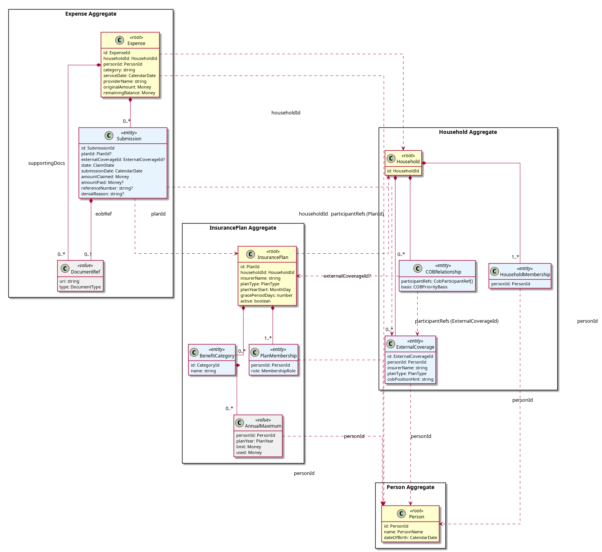

# Data Model and Storage

This document defines the solution-level domain model — aggregate boundaries, entities, value objects, invariants, and storage mapping. It bridges from the [conceptual domain model](../01-requirements/10-glossary.md#conceptual-domain-model) (analysis-level, what exists in the domain) to the implementation model (where the consistency boundaries are and why).

## Domain Model

Four aggregates form the core of the domain. Each aggregate is a transactional consistency boundary: all mutations within an aggregate are atomic, and cross-aggregate references are by identity only.



<details>
<summary>PlantUML source</summary>

```
@startuml diagrams/aggregate-map
skinparam linetype ortho
skinparam packageStyle rectangle
skinparam class {
    BackgroundColor<<root>> #FEFECE
    BackgroundColor<<entity>> #E8F4FD
    BackgroundColor<<value>> #F0F0F0
}
hide empty methods

package "Person Aggregate" as PA {
    class Person <<root>> {
        id: PersonId
        name: string
        dateOfBirth: CalendarDate
    }
}

package "Household Aggregate" as HA {
    class Household <<root>> {
        id: HouseholdId
    }
    class HouseholdMembership <<entity>> {
        personId: PersonId
        role: UserRole
    }
    class ExternalCoverage <<entity>> {
        id: ExternalCoverageId
        personId: PersonId
        insurerName: string
        planType: PlanType
        cobPositionHint: string
    }
    class COBRelationship <<entity>> {
        participantRefs: CobParticipantRef[]
        basis: COBPriorityBasis
    }
    Household *-- "1..*" HouseholdMembership
    Household *-- "0..*" ExternalCoverage
    Household *-- "0..*" COBRelationship
}

package "InsurancePlan Aggregate" as IPA {
    class InsurancePlan <<root>> {
        id: PlanId
        householdId: HouseholdId
        insurerName: string
        planType: PlanType
        planYearStart: MonthDay
        gracePeriodDays: number
        active: boolean
    }
    class PlanMembership <<entity>> {
        personId: PersonId
        role: MembershipRole
    }
    class BenefitCategory <<entity>> {
        id: CategoryId
        name: string
    }
    class AnnualMaximum <<value>> {
        personId: PersonId
        planYear: PlanYear
        limit: Money
        used: Money
    }
    InsurancePlan *-- "1..*" PlanMembership
    InsurancePlan *-- "0..*" BenefitCategory
    BenefitCategory *-- "0..*" AnnualMaximum
}

package "Expense Aggregate" as EA {
    class Expense <<root>> {
        id: ExpenseId
        householdId: HouseholdId
        personId: PersonId
        category: string
        serviceDate: CalendarDate
        providerName: string
        originalAmount: Money
        remainingBalance: Money
    }
    class Submission <<entity>> {
        id: SubmissionId
        planId: PlanId?
        externalCoverageId: ExternalCoverageId?
        state: ClaimState
        submissionDate: CalendarDate
        amountClaimed: Money
        amountPaid: Money?
        referenceNumber: string?
        denialReason: string?
    }
    class DocumentRef <<value>> {
        uri: string
        type: DocumentType
    }
    Expense *-- "0..*" Submission
    Expense *-- "0..*" DocumentRef : supportingDocs
    Submission *-- "0..1" DocumentRef : eobRef
}

' Cross-aggregate references
HouseholdMembership ..> Person : personId
PlanMembership ..> Person : personId
AnnualMaximum ..> Person : personId
Expense ..> Person : personId
COBRelationship ..> InsurancePlan : "participantRefs (PlanId)"
COBRelationship ..> ExternalCoverage : "participantRefs (ExternalCoverageId)"
ExternalCoverage ..> Person : personId
InsurancePlan ..> Household : householdId
Expense ..> Household : householdId
Submission ..> InsurancePlan : planId
Submission ..> ExternalCoverage : externalCoverageId?

@enduml
```

</details>

### Aggregate summary

| Aggregate | Root | Internal Entities | Key Value Objects | Key Invariants |
|-----------|------|-------------------|-------------------|----------------|
| Person | Person | — | CalendarDate | Single identity across households (GLO-002, FR-040) |
| Household | Household | HouseholdMembership, COBRelationship, ExternalCoverage | UserRole, COBPriorityBasis, CobParticipantRef | ≥ 1 Insurance Manager (NFR-044); COBRelationship references only plans and ExternalCoverage scoped to this household |
| InsurancePlan | InsurancePlan | PlanMembership, BenefitCategory | AnnualMaximum, PlanType, PlanYear | AnnualMaximum.used ≤ AnnualMaximum.limit; all PlanMembership persons exist |
| Expense | Expense | Submission | DocumentRef, ClaimState, Money | No-overclaim: sum of amountPaid across submissions ≤ originalAmount (NFR-008); valid state transitions only (ADR-002) |

### Domain services (not aggregates)

| Service | Purpose | Operates on |
|---------|---------|-------------|
| RoutingEngine | Determines the next applicable plan for an expense (GLO-030) | Receives Expense + InsurancePlan[] + ExternalCoverage[] + COBRelationship[] as parameters; pure computation, no I/O. Operates within a single Household. When ExternalCoverage has higher COB priority than internal plans, recommends "submit to [external] first" without evaluating eligibility or limits (GLO-035, FR-010). |
| BalanceTracker | Updates plan balance state after a payment (FR-050) | Receives InsurancePlan[] + payment details; mutates AnnualMaximum values on the plans |

These are domain services because they coordinate logic across aggregate boundaries. The Application Service loads the required aggregates, passes them in, and saves the results (see [claim lifecycle sequence](02-architecture.md#core-claim-lifecycle-flow)).

## Aggregate Boundaries

### Person

**Boundary decision**: Person is a separate aggregate root, not contained within Household.

**Rationale**: A Person has a single identity across the system (GLO-002). A Person may belong to multiple Households via HouseholdMembership (GLO-033, FR-040). If Person were internal to Household, each Household would hold its own copy, violating the "no duplicate Person records" requirement (FR-040). Person is also referenced by Expense (the person who incurred it), by PlanMembership (the person covered by a plan), and by AnnualMaximum (the person whose limit is tracked). All of these are cross-aggregate references by PersonId.

**Lifecycle**: Created when a user adds a family member. Persists independently of any Household — removing a Person from a Household does not delete them if they belong to another Household. A Person may optionally have a SystemUser identity (GLO-006) for authentication; this is modeled as an optional SystemUserId reference, with authentication concerns handled outside the domain (Phase 4+).

### Household

**Boundary decision**: Household is an aggregate root containing HouseholdMembership, COBRelationship, and ExternalCoverage as internal entities.

**Rationale**: HouseholdMembership is scoped to a single Household and has no meaning outside it — it represents "this Person belongs to this Household with this role." COBRelationship is similarly scoped: it defines the coordination order between plans and ExternalCoverage within this Household (GLO-020, FR-042, GLO-035). ExternalCoverage records lightweight references to coverage a Person has outside this Household — enough for COB ordering, without plan details (limits, utilization). Both are configuration entities that change infrequently and are always accessed in the context of their Household.

The Household aggregate represents the family unit's configuration: who is in it, and how their plans coordinate. This is the natural consistency boundary for operations like "add a family member and set up their COB relationships" — both should succeed or fail atomically.

**HouseholdMembership references Person by ID**, not by containment. When a Person is added to a second Household, a new HouseholdMembership is created in the second Household referencing the existing PersonId. The Person aggregate is not modified.

### InsurancePlan

**Boundary decision**: InsurancePlan is an aggregate root containing PlanMembership, BenefitCategory, and AnnualMaximum.

**Rationale**: A plan's configuration (who it covers, what categories it has, what the limits are) is a cohesive unit. All of these entities are meaningless outside the context of their plan. PlanMembership records which Persons are covered and in what capacity (Insured vs Beneficiary) — this is needed by the RoutingEngine to apply the Employee-First Rule (GLO-021) and Birthday Rule (GLO-022). BenefitCategory defines what expense types the plan covers. AnnualMaximum tracks both the configured limit and the current usage per person per plan year.

**AnnualMaximum includes tracked usage** (`used` field) alongside the configured `limit`. This is a pragmatic decision: the RoutingEngine needs both the limit and current usage to determine whether a plan is exhausted (GLO-018). Keeping them together avoids a cross-aggregate read. The BalanceTracker domain service mutates AnnualMaximum values on InsurancePlan aggregates — the Application Service passes the plans in and saves them afterward.

**HCSA and PHSP plans** use the same model: an HCSA is an InsurancePlan with `planType = HCSA` and a single BenefitCategory representing the total allocation. This unifies the storage and routing model across plan types, with the RoutingEngine applying HCSA-specific rules (last-payer, FR-013) based on planType.

**Cross-aggregate references**: InsurancePlan references Household by `householdId` (plans are scoped to a household). PlanMembership references Person by `personId`. COBRelationship (in the Household aggregate) references InsurancePlan by `planId`.

### Expense

**Boundary decision**: Expense is an aggregate root containing Submission and DocumentRef. The ClaimStateMachine is internal behavior of this aggregate.

**Rationale**: The Expense is the top-level unit of work in Coordinate (GLO-024). All Submissions belong to a single Expense and are always accessed through it. The no-overclaim invariant (NFR-008) — that total reimbursement across all submissions never exceeds the original amount — spans the Expense and its Submissions, making this a natural consistency boundary. The remaining balance is a derived value maintained by the aggregate as submissions resolve.

**The ClaimStateMachine** (ADR-002) is not a standalone domain component. It is internal behavior of the Expense aggregate, enforcing valid state transitions on Submissions. When the Application Service calls `expense.recordOutcome(submissionId, outcome)`, the aggregate internally validates the transition via the state machine, updates the Submission's state, recalculates the remaining balance, and rejects invalid transitions.

**Submission** is an entity (not a value object) because it has identity — a SubmissionId — and a lifecycle (state transitions from `submitted` through adjudication to a terminal state). But it has no independent lifecycle: a Submission is always created, accessed, and mutated through its parent Expense.

**DocumentRef** is a value object. Documents are stored by reference (NFR-051) — a URI pointing to a local file or cloud storage. The actual document bytes are external to the domain. DocumentRef appears on both Expense (supporting documents like receipts) and Submission (EOB reference). ExplanationOfBenefits metadata (amount claimed, amount paid, denial reasons per GLO-028) is captured directly on the Submission entity; the EOB document itself is just a DocumentRef.

### Household as Data Isolation Boundary

Household is the **attribute-based access control (ABAC) boundary** for all domain data (NFR-045). Plan data — coverage limits, utilization tracking, claim status, and data retrieved via browser extension (FR-091, FR-092) — is scoped to the Household that owns the relevant InsurancePlan. Plan data is never accessible from another Household, even if the same Person belongs to both.

Cross-household COB (e.g., a Person with coverage in multiple Households per PER-001 Mira scenario) is handled via **ExternalCoverage + document sharing**, not plan data sharing. When Ben enters an expense for Mira in his Household after she has processed it through her spouse's plan in her own Household, he records the outcome via FR-046 (pre-recorded external submission) and attaches the EOB. The RoutingEngine picks up from the remainder through Ben's Household's plans. No plan data from Mira's Household crosses the boundary.

## Data Dictionary

### Shared value types

| Type | Definition | Examples |
|------|------------|---------|
| Money | Non-negative decimal amount in CAD. Precision: 2 decimal places. | `125.00`, `0.00` |
| CalendarDate | Date without time zone, ISO 8601 format. | `2026-03-15` |
| MonthDay | Month and day only (for plan year start, birthday rule). | `01-01`, `09-15` |
| PlanYear | A specific 12-month benefit period, identified by start date. | `2026-01-01` (for a plan year starting Jan 1, 2026) |
| PlanType | Enum: `GroupHealth`, `GroupDental`, `HCSA`, `PHSP` | |
| MembershipRole | Enum: `Insured`, `Beneficiary` | |
| UserRole | Enum: `InsuranceManager`, `Contributor` | |
| COBPriorityBasis | Enum: `Standard` (CLHIA rules apply), `Explicit` (user-configured order) | |
| ClaimState | Enum: `submitted`, `processing`, `paid_full`, `paid_partial`, `rejected_fixable`, `rejected_final`, `audit`, `limit_hit`, `closed_zero`, `closed_oop` | Per GLO-027 |
| DocumentType | Enum: `Receipt`, `EOB`, `Referral`, `Prescription`, `LabRequisition` | Per GLO-034 |
| Percentage | Decimal 0–100, 2 decimal places. Used for coinsurance rates. | `80.00` |
| CobParticipantRef | Discriminated union: `{ planId: PlanId }` or `{ externalCoverageId: ExternalCoverageId }` | References either an internal InsurancePlan or ExternalCoverage for COB ordering |

### Person Aggregate

| Field | Type | Constraints | Notes |
|-------|------|-------------|-------|
| id | PersonId (UUID) | PK, immutable | |
| name | string | Required, non-empty | Display name; no formal given/family split for MVP |
| dateOfBirth | CalendarDate | Required | Used for Birthday Rule (GLO-022) |
| systemUserId | SystemUserId? | Optional, unique | Links to authentication identity (Phase 4+) |

### Household Aggregate

**Household**

| Field | Type | Constraints | Notes |
|-------|------|-------------|-------|
| id | HouseholdId (UUID) | PK, immutable | |
| name | string | Required | Display name for household context switching (GLO-033) |

**HouseholdMembership**

| Field | Type | Constraints | Notes |
|-------|------|-------------|-------|
| id | MembershipId (UUID) | PK, immutable | |
| householdId | HouseholdId | FK → Household, immutable | |
| personId | PersonId | FK → Person (cross-aggregate) | |
| role | UserRole | Required | InsuranceManager or Contributor (GLO-007). Only meaningful when Person is a SystemUser. |

Invariant: each Household must have at least one HouseholdMembership with role = InsuranceManager (NFR-044).

**ExternalCoverage**

| Field | Type | Constraints | Notes |
|-------|------|-------------|-------|
| id | ExternalCoverageId (UUID) | PK, immutable | |
| householdId | HouseholdId | FK → Household, immutable | |
| personId | PersonId | FK → Person (cross-aggregate) | The person who has this external coverage |
| insurerName | string | Required | Display name for routing explanation (e.g., "Mira's spouse's plan") |
| planType | PlanType | Required | GroupHealth, GroupDental, HCSA, or PHSP |
| cobPositionHint | string | Required | Enough for RoutingEngine to place in COB order (e.g., "primary per birthday rule"). Used when basis = Standard. |

ExternalCoverage has no benefit categories, limits, or utilization — only COB ordering information (GLO-035, FR-045).

**COBRelationship**

| Field | Type | Constraints | Notes |
|-------|------|-------------|-------|
| id | COBRelationshipId (UUID) | PK, immutable | |
| householdId | HouseholdId | FK → Household, immutable | |
| participantRefs | CobParticipantRef[] | ≥ 2 elements; references plans and/or ExternalCoverage scoped to this household | Ordered list for Explicit basis; for Standard, RoutingEngine applies CLHIA to plans and inserts ExternalCoverage per cobPositionHint |
| basis | COBPriorityBasis | Required | `Standard` = CLHIA rules (Employee-First + Birthday); `Explicit` = user-configured order (participantRefs order) |

### InsurancePlan Aggregate

**InsurancePlan**

| Field | Type | Constraints | Notes |
|-------|------|-------------|-------|
| id | PlanId (UUID) | PK, immutable | |
| householdId | HouseholdId | FK → Household (cross-aggregate), immutable | |
| insurerName | string | Required | e.g., "Sun Life", "Manulife" |
| planType | PlanType | Required | Determines routing behavior (HCSA-last-payer, PHSP rules) |
| planYearStart | MonthDay | Required | e.g., `01-01` for calendar-year plans (GLO-017) |
| gracePeriodDays | number | Required, ≥ 0 | Days after plan year end to submit prior-year claims (FR-041) |
| active | boolean | Required, default true | Set to false when plan ends (FR-043) |
| effectiveDate | CalendarDate | Required | When coverage began; tiebreaker for Birthday Rule (GLO-022) |
| endDate | CalendarDate? | Optional | Set when plan is deactivated (FR-043) |

**PlanMembership**

| Field | Type | Constraints | Notes |
|-------|------|-------------|-------|
| id | PlanMembershipId (UUID) | PK, immutable | |
| planId | PlanId | FK → InsurancePlan, immutable | |
| personId | PersonId | FK → Person (cross-aggregate) | |
| role | MembershipRole | Required | `Insured` = primary subscriber (GLO-004); `Beneficiary` = dependent (GLO-005) |

Invariant: exactly one PlanMembership with role = Insured per InsurancePlan.

**BenefitCategory**

| Field | Type | Constraints | Notes |
|-------|------|-------------|-------|
| id | CategoryId (UUID) | PK, immutable | |
| planId | PlanId | FK → InsurancePlan, immutable | |
| name | string | Required | e.g., "Paramedical", "Dental Preventive", "Vision" (GLO-015) |
| coinsuranceRate | Percentage? | Optional | e.g., 80% = plan pays 80% of eligible amount |

For HCSA plans, a single BenefitCategory (e.g., "All CRA-Eligible Expenses") with one AnnualMaximum representing the total HCSA allocation.

**AnnualMaximum** (value object)

| Field | Type | Constraints | Notes |
|-------|------|-------------|-------|
| personId | PersonId | FK → Person (cross-aggregate) | The covered person this limit applies to (GLO-016) |
| planYear | PlanYear | Required | Which plan year this limit applies to |
| limit | Money | Required, > 0 | Configured cap for this category × person × plan year |
| used | Money | Required, ≥ 0, ≤ limit | Amount consumed by paid claims. Updated by BalanceTracker. |

Identity: (categoryId, personId, planYear) — compound natural key. Replaced (not mutated) on update per value object semantics.

### Expense Aggregate

**Expense**

| Field | Type | Constraints | Notes |
|-------|------|-------------|-------|
| id | ExpenseId (UUID) | PK, immutable | |
| householdId | HouseholdId | FK → Household (cross-aggregate), immutable | Scoped to household context (GLO-033) |
| personId | PersonId | FK → Person (cross-aggregate), immutable | The person who incurred the expense (GLO-024) |
| category | string | Required | Maps to BenefitCategory names for routing. User-entered. |
| serviceDate | CalendarDate | Required | Date the service was received |
| providerName | string | Required | e.g., "Dr. Smith", "Shoppers Drug Mart" |
| originalAmount | Money | Required, > 0, immutable | Total expense amount |
| remainingBalance | Money | Required, ≥ 0 | Derived: originalAmount − sum(submission.amountPaid). Maintained by aggregate. (GLO-025) |
| supportingDocs | DocumentRef[] | 0..* | Receipts, referrals, prescriptions (GLO-034, FR-002) |

Invariant: `remainingBalance = originalAmount − sum(submissions.filter(s => s.amountPaid != null).map(s => s.amountPaid))`. Enforced by the aggregate on every mutation.

Invariant: `sum(amountPaid) ≤ originalAmount` (NFR-008, FR-023).

**Submission**

| Field | Type | Constraints | Notes |
|-------|------|-------------|-------|
| id | SubmissionId (UUID) | PK, immutable | |
| expenseId | ExpenseId | FK → Expense, immutable | |
| planId | PlanId? | FK → InsurancePlan (cross-aggregate), optional | The plan this claim was submitted to. Null for pre-recorded external submissions (FR-005, FR-046). |
| externalCoverageId | ExternalCoverageId? | FK → ExternalCoverage (cross-aggregate), optional | Set for pre-recorded external submissions (FR-046). Exactly one of planId or externalCoverageId must be set. |
| state | ClaimState | Required | Governed by internal ClaimStateMachine (ADR-002) |
| submissionDate | CalendarDate | Required | When the claim was submitted to the plan |
| amountClaimed | Money | Required, > 0, ≤ expense.remainingBalance at time of submission | FR-023 |
| amountPaid | Money? | Set on adjudication | Amount the plan paid. Null until adjudicated. |
| referenceNumber | string? | Optional at submission, encouraged once received | Insurer claim reference (FR-020) |
| denialReason | string? | Set if rejected | Free text; insurer's stated reason |
| eobRef | DocumentRef? | Set after adjudication | Reference to the Explanation of Benefits document (GLO-028, FR-022) |

**DocumentRef** (value object)

| Field | Type | Constraints | Notes |
|-------|------|-------------|-------|
| uri | string | Required, non-empty | Local file path or cloud storage URL (NFR-051) |
| type | DocumentType | Required | Receipt, EOB, Referral, Prescription, LabRequisition |

## Storage Strategy

The PWA stores all aggregate state locally. There is no backend database for MVP.

### PWA (IndexedDB / SQLite-WASM via OPFS)

Each aggregate root maps to an IndexedDB object store (or SQLite table if using SQLite-WASM). Internal entities and value objects are stored as nested JSON within the aggregate root's record — not normalized into separate stores. This preserves the aggregate as the unit of read and write, consistent with the transactional consistency boundary.

| Aggregate | Object Store / Table | Key | Indexes |
|-----------|---------------------|-----|---------|
| Person | `persons` | `id` | `name` |
| Household | `households` | `id` | — |
| InsurancePlan | `insurance_plans` | `id` | `householdId`, `planType`, `active` |
| Expense | `expenses` | `id` | `householdId`, `personId`, `serviceDate`, `category` |

Submissions, PlanMemberships, BenefitCategories, AnnualMaximums, HouseholdMemberships, COBRelationships, ExternalCoverage, and DocumentRefs are all embedded within their aggregate root's record.

IndexedDB transactions can span multiple object stores, so cross-aggregate updates (e.g., updating an Expense and an InsurancePlan's AnnualMaximum in the RecordOutcomeUseCase) can be atomic within a single IndexedDB transaction.

### Cross-aggregate consistency

Cross-aggregate updates (e.g., Expense + InsurancePlan in RecordOutcomeUseCase) occur within a single local transaction, which is possible because all data is in one local store. This is a simplification enabled by the local-first architecture (ADR-003). If the system later moves to multi-device sync or separate storage per aggregate, eventual consistency patterns (domain events, the Event Storing Subscriber pattern) would replace the single-transaction approach — the architectural seam for this is the domain event "effects" already returned by the state machine (ADR-002).

## Data Lifecycle

### Retention

CRA requires supporting documents (receipts) to be kept for 6–7 years (NFR-006). This establishes a practical floor for all claim-related records: Expenses, Submissions, and their associated DocumentRefs must be retained for at least this period. The system warns before deletion of any record within the retention window (FR-062).

InsurancePlan and Household configuration is retained indefinitely — historical plan configurations are needed to understand past routing decisions and for reporting (FR-043).

Person records are retained as long as they are referenced by any Household, Expense, or InsurancePlan.

### Export and import

All structured data is exportable in a portable format (JSON or CSV) per NFR-050. Import supports validation, conflict detection, and user-driven resolution (NFR-053). Export and import operate at the aggregate level — each aggregate can be exported and imported independently, with referential integrity validated on import (e.g., an imported Expense references a PersonId that must exist or be included in the import batch).

### Plan year transitions

AnnualMaximum values are per plan year. When a new plan year begins, new AnnualMaximum entries (with `used = 0`) are created for the new year. Prior-year entries are retained for the grace period and for historical reference. During the grace period, claims with a service date in the prior plan year are applied against the prior year's AnnualMaximum, not the current year's (FR-051).
