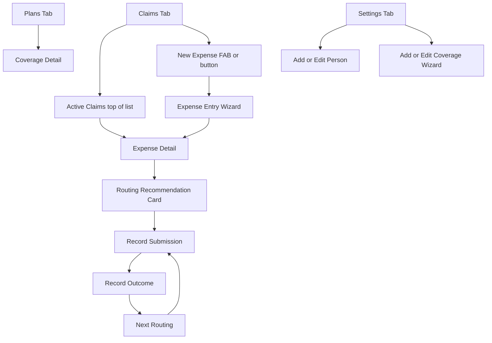

# UI/UX Design

This document sets durable principles and captures the MVP (Phase 1) UI scope. Future phases are described directionally — not specified. This avoids over-engineering screens that don't exist yet while still recording design intent.

---

## Design Principles

These are durable — they apply to every phase. Derived directly from requirements, not generic.

- **Action-driven**: Every screen has one primary action. The system always knows what happens next and surfaces it. No dead ends.
- **Progressive disclosure**: COB complexity is hidden until the user needs it. Routing explanations appear *after* the recommendation, not as a prerequisite to it.
- **Plain language**: No insurance term used without a plain-language label or tooltip alongside it.
- **Receipt-first on mobile**: The most common mobile task (attach a receipt, enter a new expense) must be reachable in ≤ 3 taps from any screen.
- **No silent failures**: Broken document references, rejected claims, and expired benefits must surface visibly. Nothing is silently dropped.
- **WCAG 2.1 AA as a floor**: Accessibility is enforced in CI, not audited after the fact.

---

## Technology Direction

A single recommendation. Full rationale will be recorded in a forthcoming ADR.

**Chosen direction: React + Ant Design 5.x, themed with custom design tokens.**

Rationale for MVP:

- AntD ships `Form`, `Steps`, `Table`, `Timeline`, `Statistic`, and `Drawer` out of the box — all of which map directly to the claim lifecycle UI (multi-step expense entry, submission timeline, balance stats, coverage drawer).
- This trades bundle size (~1 MB before tree-shaking) for the fastest path to working MVP screens, which is the right trade for a single-maintainer project.
- Custom design tokens (`colorPrimary`, `borderRadius`, etc.) in AntD 5 are sufficient to shed the enterprise aesthetic.
- The tab bar and camera capture (mobile) require a thin custom layer on top of AntD layout primitives — this is documented as a known gap.

**Future**: Framework choice is revisited if a PWA shell or browser extension (Phase 6) introduces incompatibilities. The ports-and-adapters architecture means the UI layer is replaceable without touching domain logic.

---

## Information Architecture

### Navigation: Adaptive Tab Bar

```
Mobile (bottom bar)           Desktop (left sidebar)
─────────────────────         ──────────────────────────
[Claims] [Plans] [Settings]   Claims | Plans | Settings
```

**MVP has three tabs.** Reports and Alerts tabs are added in later phases.

| Tab      | Route       | Phase   | Primary content                                                       |
| -------- | ----------- | ------- | --------------------------------------------------------------------- |
| Claims   | `/claims`   | **MVP** | All expenses + active claim cards; entry point for new expenses       |
| Plans    | `/plans`    | **MVP** | Coverage cards grouped by insurer; balance per person per category    |
| Settings | `/settings` | **MVP** | Household members, coverages, COB relationships, data export          |
| Alerts   | `/alerts`   | Phase 2 | Deadline warnings, expiry notices, utilization alerts                 |
| Reports  | `/reports`  | Phase 3 | Year-end unreimbursed total, HCSA utilization, expense history export  |

**No Dashboard tab in MVP.** The Claims tab *is* the dashboard — it shows active (in-progress) claims at the top and the full expense history below. A dedicated Dashboard tab can be added in Phase 2 when Alerts provides meaningful content to surface there.

**Household context switcher**: Persistent header chip/dropdown. Switching re-scopes all tabs. MVP supports it as a pure UI navigation (no auth — ADR-010).

### MVP Screen Hierarchy



---

## MVP Key Screens (Phase 1)

Only Phase 1 screens are described in detail here. Future-phase screens are noted in Future Direction.

### Claims Tab (list view)

Two visual groups within a single scrollable list:

- **In-progress claims** (top, prominent): One card per expense where `remainingBalance > 0` or state is not terminal. Each card shows: person name, expense category, service date, remaining balance, current `ClaimState` badge, primary action button ("Record Outcome", "Submit to next plan", etc.).
- **Closed claims** (below, subdued): Collapsed by default on mobile. Shows `closed_zero` and `closed_oop` expenses.

**Entry point for new expenses**: A floating action button (mobile) or a persistent "New Expense" button (desktop) in the tab header.

### Expense Entry Wizard

Multi-step flow inside a drawer (desktop) or bottom sheet (mobile). Not a full page navigation — the Claims list stays visible behind it on desktop.

1. **Who & What**: Person selector (from Household members), expense category (free text with autocomplete from past entries), service date, provider name.
2. **Amount & Routing**: Original amount. Once person + category are filled, `GetRoutingRecommendationUseCase` is called and the first recommended plan is shown inline — the user sees the routing *while entering the amount*, before committing.
3. **Documents**: Attach receipt. `<input type="file" accept="image/*" capture="environment">` triggers camera on mobile. Doc type label: Receipt / Referral / Prescription / Lab Requisition.
4. **Confirm**: Full summary. "Save expense" calls `SubmitExpenseUseCase` and navigates to Expense Detail.

### Expense Detail (Claim Lifecycle View)

The primary working view for an in-progress claim.

- **Header strip**: Person, category, service date, provider. Original amount and remaining balance side by side — remaining balance is large and prominent.
- **Routing recommendation card** (shown when `remainingBalance > 0` and a next plan exists): Plan name + primary action button ("I submitted this"). Collapsed plain-language explanation below ("Why this plan? ▼"). Tapping expands the full COB reasoning from `GetRoutingRecommendationUseCase`.
- **Submission timeline**: Vertical stepper. Each step = one `Submission` entity. Shows: coverage name, `ClaimState` badge, amount claimed, amount paid (if adjudicated), denial reason (if applicable), EOB document attachment slot.
- **Documents panel**: All `DocumentRef` entries attached to the expense. Broken references (URI no longer accessible) show a visible warning icon — not a silent 404.

### Plans Tab (Coverage Overview)

- **Coverage cards grouped by insurer name**: One card per `Coverage` aggregate. Card header = insurer name + plan type badge.
- **Per-category balance bars** inside each card: Progress bar showing `AnnualMaximum.used / limit` per `BenefitCategory`. Shared-pool HCSA AnnualMaximum shown as a single bar.
- **Plan year chip**: Days remaining in current plan year; grace period end date if applicable.
- **Tap to expand**: Members list (Insured + Beneficiaries with roles).

### Settings → Coverage Wizard

Multi-step drawer/sheet for creating or editing a `Coverage` aggregate:

1. Insurer name, portal URL, plan type (`GroupHealth` / `GroupDental` / `HCSA` / `PHSP`), effective date.
2. Plan year start (month + day), grace period days, active toggle.
3. Benefit categories: add/remove rows with name, coinsurance rate, limit window mode, limit cycle months.
4. Annual maxima: per-person or shared pool, dollar limit.
5. COB priority (optional integer, used by Routing Engine).

### Settings → Household & Members

- List of `HouseholdMembership` entries (person name, date of birth, role).
- Add / edit person form: given name, family name, date of birth.
- External Coverage list: lightweight COB-reference entries for plans held outside this household.

---

## Future Direction (Phase 2+)

Described directionally — not specified. Each phase adds to the established IA without restructuring it.

**Phase 2 — Alerts tab**: A dedicated Alerts tab surfaces deadline warnings (claim submission deadlines, grace period ends), expiring HCSA balance notices, and `rejected_fixable` claims that need user action. The Claims tab gets a badge count. A future Dashboard tab may consolidate Alerts + active claims in one view.

**Phase 3 — Reports tab**: Year-end unreimbursed expense summary (feeds METC calculation), HCSA utilization by plan year, full expense history with CSV export. The Claims tab history view becomes a navigable export source.

**Phase 4 — Contributor role**: A second persona (e.g., Sobia) can add expenses and attach documents on mobile. The household context switcher gains an access model. Sync indicator appears in the header when changes are pending relay upload.

**Phase 5 — Smart suggestions**: Provider autocomplete pulls from expense history. Category is pre-filled based on provider name. Multi-beneficiary attribution UI (one expense split across multiple dependents).

**Phase 6 — Insurer automation**: A browser extension status bar appears inside the insurer portal, surfacing the current claim's reference number and expected EOB. Automated submission adds an "Auto-submit" action to the Routing Recommendation card.

---

## Interaction Patterns (MVP)

- **Bottom sheets (mobile) / drawers (desktop)**: Expense wizard, coverage wizard, document viewer. Preserve the list context behind the sheet — no full-page navigations for transient tasks.
- **Toast notifications**: Non-blocking, short-lived feedback for successful actions ("Expense saved", "Outcome recorded"). Errors and warnings use inline messages on the affected element — not toasts.
- **ClaimState badges**: Pill badges with consistent color + icon for every `ClaimState` value. Color is never the only indicator (icon + label always present). Proposed palette:
  - `submitted` → blue
  - `processing` → blue (spinner icon)
  - `paid_full` → green
  - `paid_partial` → teal
  - `rejected_fixable` → amber
  - `rejected_final` → red
  - `limit_hit` → orange
  - `closed_zero` → green (muted)
  - `closed_oop` → grey
- **Inline routing explanation**: The "Why this plan?" detail is collapsed by default. Tapping expands a plain-text paragraph from `GetRoutingRecommendationUseCase`. No modal — inline toggle.
- **Offline indicator**: A slim banner appears at the top of all screens when `navigator.onLine === false`. No destructive actions are blocked (IndexedDB works offline); the banner is informational.
- **Camera capture**: `<input type="file" accept="image/*" capture="environment">` — no custom camera overlay in MVP. Native OS camera is invoked directly.

---

## Responsive & Accessibility Strategy

### Breakpoints

- `< 640px` (mobile): Bottom tab bar, full-width bottom sheets, camera-first document attach, single-column layouts.
- `640–1024px` (tablet): Sidebar collapsed to icon rail, two-column expense detail (header + timeline side by side).
- `> 1024px` (desktop): Full sidebar with labels, drawers instead of bottom sheets, multi-column claims list.

### Accessibility (WCAG 2.1 AA — enforced in CI)

- `@axe-core/playwright` runs on every E2E test run. Lighthouse accessibility score ≥ 90 gated in CI.
- **Focus management**: When a sheet or drawer opens, focus moves to the first interactive element inside it. When it closes, focus returns to the trigger element.
- **Color is never the only indicator**: ClaimState badges carry both color and an icon + text label.
- **Icon-only buttons**: All icon buttons carry an `aria-label`. No unlabeled interactive elements.
- **Touch targets**: Minimum 44 × 44 px (WCAG 2.5.5).
- **Reduced motion**: All transitions respect `prefers-reduced-motion: reduce`.
- **Routing explanation card**: Wrapped in `role="region"` with `aria-label="Routing recommendation"` so screen reader users can landmark-navigate to it directly.
