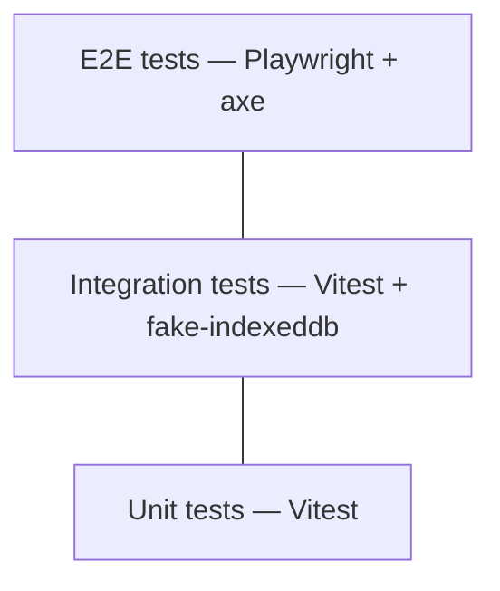

# Testing Strategy

## Test Pyramid

The test suite is structured as three layers. The bulk of tests are at the unit level where the core domain logic lives. Integration tests verify use case orchestration with real storage adapters. E2E tests cover critical user flows in a real browser.



### Unit tests (Vitest)

Pure domain logic with zero adapter dependencies. These tests are fast, deterministic, and run on every commit.

**What they cover**:

- `RoutingEngine`: COB priority rules — employee-first, birthday rule, duration-of-coverage tiebreaker, HCSA-last-payer, PHSP explicit ordering, External Coverage cobPositionHint. Every decision path must have at least one test (NFR-030).
- `ClaimStateMachine`: All valid state transitions and rejection of invalid transitions. Guards (e.g., cannot transition to `paid_full` without `amountPaid`) are tested explicitly.
- `BalanceTracker`: `AnnualMaximum.used` updates, shared-pool HCSA balance deduction, plan year reset, grace period window calculations.
- Aggregate invariants: No-overclaim (`sum(amountPaid) <= originalAmount`, NFR-008), `remainingBalance` derivation, `CoverageMembership` constraints (exactly one Insured per Coverage).
- Value objects: `Money` arithmetic, `CalendarDate` comparisons, `PersonName` formatting.

### Integration tests (Vitest + fake-indexeddb)

Use cases exercised with a real Dexie.js adapter backed by `fake-indexeddb` (an in-memory IndexedDB implementation for Node.js). These tests verify that the application layer correctly orchestrates domain logic and storage.

**What they cover**:

- Use case orchestration: `SubmitExpenseUseCase` creates an Expense aggregate and calls `RoutingEngine`. `RecordOutcomeUseCase` updates both the Expense and the Coverage aggregate's `AnnualMaximum` within a single IndexedDB transaction.
- Cross-aggregate consistency: After `RecordOutcomeUseCase`, both the Expense's `remainingBalance` and the Coverage's `AnnualMaximum.used` reflect the payment.
- Query use cases: `GetRoutingRecommendationUseCase` loads the correct Coverage and ExternalCoverage aggregates and returns a recommendation with explanation.
- Schema migrations: Dexie version upgrades (ADR-008) are tested by creating a database at version N, running the migration to version N+1, and verifying data integrity.

### E2E tests (Playwright)

Full browser tests against the production build (`vite preview`). These are expensive and focus on critical user flows — not exhaustive UI coverage.

**What they cover**:

- Critical user flows: expense entry through closure, coverage wizard, household context switching.
- Accessibility: `@axe-core/playwright` runs an axe scan on every page visited during E2E tests (NFR-060).
- Offline behaviour: Service worker caching allows the app to function when `navigator.onLine` is simulated as `false`.
- Broken document reference: A referenced URI that returns 404 shows a visible warning icon on the expense.

### Ratio guidance

Heavy unit tests (domain logic is the core value), moderate integration tests (use case orchestration and storage), light E2E tests (expensive, focus on critical paths). No specific coverage percentage target — the requirement is that every critical decision path has at least one test (NFR-030).

## Test Environments

| Layer | Runtime | IndexedDB | Data |
|-------|---------|-----------|------|
| Unit | Node.js (Vitest) | Not used | Constructed in-test via factory functions |
| Integration | Node.js (Vitest) | `fake-indexeddb` (in-memory) | Seeded per test via Dexie API; torn down after each test |
| E2E | Chromium (Playwright) | Real browser IndexedDB | Clean per test via Playwright browser context isolation; seeded via application UI or direct IndexedDB injection |

**CI**: All three layers run in GitHub Actions. E2E tests use Playwright's Docker container for consistent Chromium versions across CI runs.

**Test data factories**: Shared factory functions produce valid aggregate instances (e.g., `createExpense()`, `createCoverage()`) with sensible defaults that can be overridden per test. These factories are the single source of test data construction — no raw object literals scattered across test files.

## Key Test Scenarios

Critical paths that must always be covered. A regression in any of these indicates a serious defect.

| Scenario | Layer | Maps to |
|----------|-------|---------|
| Employee-first rule routes to the employee's own plan before the spouse's | Unit | FR-010, FR-011 |
| Birthday rule selects the correct plan when both parents cover a dependent | Unit | FR-013 |
| HCSA is always positioned as last-payer in the COB sequence | Unit | FR-012 |
| No-overclaim invariant: recording an outcome that would cause `sum(amountPaid) > originalAmount` is rejected | Unit | NFR-008 |
| Claim state machine rejects invalid transitions (e.g., `submitted` directly to `closed_zero`) | Unit | ADR-002 |
| `RecordOutcomeUseCase` updates Expense `remainingBalance` and Coverage `AnnualMaximum.used` atomically | Integration | FR-030 |
| Partial payment triggers a next routing recommendation with remaining balance | Integration | FR-031 |
| Expense with service date within grace period applies to the prior plan year's maximum | Integration | FR-052 |
| Full claim lifecycle: expense entry through routing, submission, outcome, cascade, and closure (`closed_zero`) | E2E | FR-001 through FR-033 |
| Coverage wizard creates a valid Coverage aggregate with benefit categories and annual maxima | E2E | FR-040 |
| Household context switch re-scopes all displayed data to the selected household | E2E | NFR-045 |
| Broken document reference (404 URI) displays a visible warning on the expense | E2E | NFR-051 |

## Performance / Load Testing

Not applicable for MVP. The application is single-user with small data volumes — hundreds of expenses per year, dozens of documents, 2-4 insurance plans (ASM-002). IndexedDB performance is not a concern at this scale.

**Lighthouse CI** serves as the performance gate in the CI pipeline:

- Performance score >= 90 (covers bundle size, time-to-interactive, paint metrics).
- Accessibility score >= 90 (NFR-060).

**Future**: If data volumes grow significantly (Phase 4 multi-household, years of accumulated data), targeted IndexedDB query benchmarks can be added to the integration test suite to detect regressions in query performance.

## Mutation Testing

Mutation testing is applied to the unit test suite to verify test quality and catch gaps in coverage. Stryker (`@stryker-mutator/vitest-runner`, Stryker 8.x) introduces small automated code changes (mutants) and verifies that tests catch them. A low mutation score indicates undertested logic.

**Scope**: Mutation testing targets the core domain — `RoutingEngine`, `ClaimStateMachine`, `BalanceTracker`, and aggregate invariant enforcement. Adapter code and UI components are excluded (mutation testing is most valuable for deterministic pure logic).

**Execution**: Run as a scheduled GitHub Actions job (nightly or weekly), not on every push. Mutation testing is computationally expensive and its value is in trend monitoring rather than gating individual commits. The mutation score is tracked over time; a significant drop triggers investigation.

## BDD-Style Tests

E2E tests that correspond to use case scenarios (as defined in the functional requirements) are written in a BDD style (Given / When / Then). This keeps E2E tests readable and provides direct traceability from executable tests back to user-facing behaviour.

**Approach**: Playwright test files use descriptive `describe` / `it` blocks with Given/When/Then structure in the test body. No separate Gherkin `.feature` files or Cucumber layer — the overhead of maintaining a separate feature file format is not justified for a single-maintainer project. The BDD structure lives directly in TypeScript test code.

**Example structure**:

```typescript
describe("Claim lifecycle", () => {
  it("FR-031: routes remainder to next plan after partial payment", async ({ page }) => {
    // Given an expense submitted to the primary plan
    // When the primary plan pays partially
    // Then the routing engine recommends the secondary plan
    // And the remaining balance reflects the partial payment
  });
});
```

## Acceptance Criteria Traceability

Each test references the FR or NFR it validates, providing a traceable link from requirements to executable tests.

**Conventions**:

- Test names include the FR/NFR ID as a prefix (e.g., `"FR-013: applies birthday rule when both parents cover a dependent"`).
- E2E test files are named after the feature area they validate (e.g., `claim-lifecycle.spec.ts`, `coverage-wizard.spec.ts`, `household-switching.spec.ts`).
- A traceability matrix mapping FR/NFR IDs to test files is maintained as a markdown table in this document (added once tests are implemented) or generated from test metadata via a script that parses test names for ID patterns.

**Coverage gap detection**: Any FR or NFR ID that appears in the requirements but has no corresponding test name is a coverage gap. This check can be automated as a CI step once the test suite is established.
